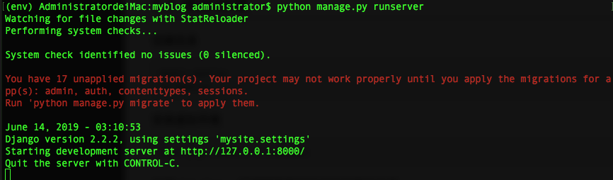
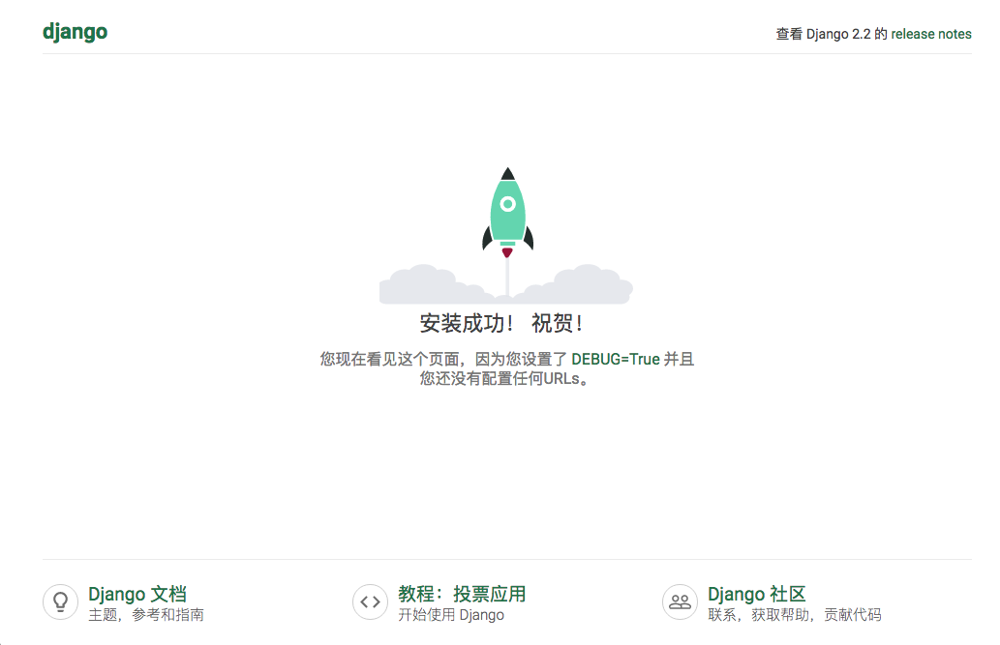
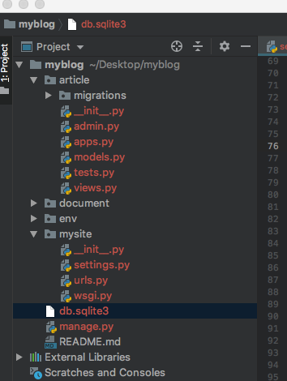

# 博客网站搭建1(环境搭建、APP注册及配置)

* [1.环境搭建](#1)
* [2.创建APP](#2)


<h1 id='1'></h1>

# 1、环境搭建

## 环境
> Python 3.7.2
> 
> MacOS High Sierra
> 
> pyCharm
> 
> django-2.2.1 
> 
> djangorestframework-3.9.4
> 

<h3 id = '1.1'></h3>

## 项目创建


#### 创建目录

	mkdir myblog
	cd myblog


#### 安装虚拟环境 
	
	sudo pip install virtualenv

#### 创建virtualenv，环境隔离我们本地的依赖包关系

	virtualenv env # 会得到下面结果回应
	
```
	Using base prefix '/usr/local/Cellar/python/3.7.2_2/Frameworks/Python.framework/Versions/3.7'
New python executable in /Users/administrator/Desktop/Django-REST-Framework/tutorial/env/bin/python3.7
Also creating executable in /Users/administrator/Desktop/Django-REST-Framework/tutorial/env/bin/python
Installing setuptools, pip, wheel...
done.

```
	source env/bin/activate #激活虚拟环境，可以看到以下结果显示
	(env) AdministratordeiMac:tutorial administrator$ 


#### 在虚拟环境安装Django
	
	pip install --upgrade pip #先升级pip
	pip install django # 安装django
	
#### 创建项目

	django-admin startproject mysite . #建立Django项目。后面"."表示在当前文件夹建立项目

#### 开启服务结果如下图所示
	
	python manage.py runserver
		


#### 打开无痕浏览模式（防止缓存），在浏览器输入http://127.0.0.1:8000/如下图：


由于Django是一个世界性的项目，所以它是支持国际化的。下面我们做一些设置：
进入mysite/setting.py文件：修改如下：

	LANGUAGE_CODE = 'zh-Hans' # 修改语言为简体中文

	TIME_ZONE = 'Asia/Shanghai' # 修改时区（这里只能是上海，设置其他地方会报错的）

然后你就返现内容变成中文了，如下图：




<h3 id='2'></h3>

# 2. 创建APP

在Django中的一个APP代表一个功能模块，开发者可以将不同功能的模块放在不同的APP中，方便代码的复用。APP就是项目的基本，因此开发博客的第一步就是创建新的APP，由来实现跟文章相关的功能模块。

打开命令，进入所在项目目录(注意是前面提到的虚拟环境，前面带有（env）的命令行)：

	(env) AdministratordeiMac:myblog administrator$ python manage.py startapp article

现在文件结构目录如下：



### 项目结构分析
> * 根目录`myblog`下有两个文件：
> 	* db.sqlite3是一个轻量级的数据库，用来存储项目产生的数据，比如博客文章等。  
> 	* `manage.py`是醒目执行命令的入口，例如`runserver`
> 
> * 目录 article是刚创建出来的APP，用来存放博客文章相关的内容。
>	* admin.py 后台管理文件
> 	* molds.py 数据模型文件
> 	* views.py 视图文件
> 	* migrates 存放数据迁移文件目录
> 
>暂时了解这些就够了,后面遇到问题再去查找问题，不要抓着一个问题不放，止步不前，你会永远都在出发的路上，而不是行走的路上。

### 注册APP

进入目录mysite/setting.py文件：

```
INSTALLED_APPS = [
    'django.contrib.admin',
    'django.contrib.auth',
    'django.contrib.contenttypes',
    'django.contrib.sessions',
    'django.contrib.messages',
    'django.contrib.staticfiles',
    'article', #新增
]
```

### 配置访问路径

在mysite/urls.py文件中,修改如下：

```
from django.urls import path, include  # 新增include导入

urlpatterns = [
    path('admin/', admin.site.urls),
    path('article/', include('article.urls', namespace='article')), # 新增
]

```
> path为Django路由的语法：
> 
> * 参数`article/`分配了APP的访问路径
> * include将路径分发给下一个处理
> * namespace可以保证反查到唯一的url，即使不同的APP使用了相同的url（后面会用到）。 
> 

 开发环境下， article的访问路径是`http://127.0.0.1:8000/article/`
 就这样吗？当然不是，现在我们已经通过`path`将根路径为`article`的访问都分发给了`article`这个APP去处理。但是APP通常有多个页面，所以还需要APP自己也有一个路由的分发，也就是`article.urls`了。
 例如如下的路径：
> http://127.0.0.1:8000/article/list/
> 
> http://127.0.0.1:8000/article/detail/
> 
> app中的url就是用来区分他们的。也有些人把这个都写在根url那里，不过不建议这样写。


在app生成的时候，并没有自动创建urls这个文件，所以我们自己在article文件夹下创建一个文件`urls.py`. 并添加下面内容

```
# article/urls.py

# 引入path
from django.urls import path

# 正在部署的APP名称
app_name = 'article'

urlpatterns = [
    
]
```

`urlpatterns`暂时是空的，以后会慢慢添加的。不急。
此时，我们的基本APP就配置完成了。
> 注意此时的APP还没有完全写好，因此启动服务器访问路径可能会报错，这个正常的呢。
> 
> Django2.0以后，app的`urls.py`必须配置`app_name`,否则会报错。