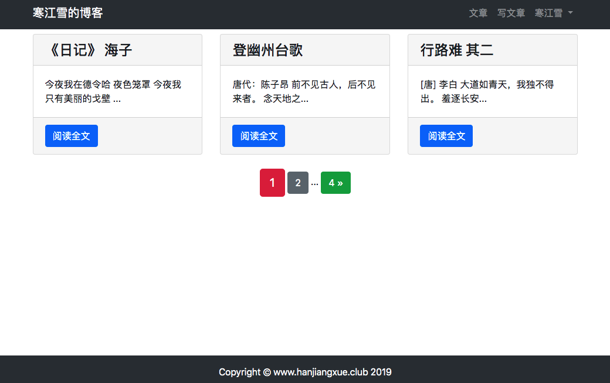
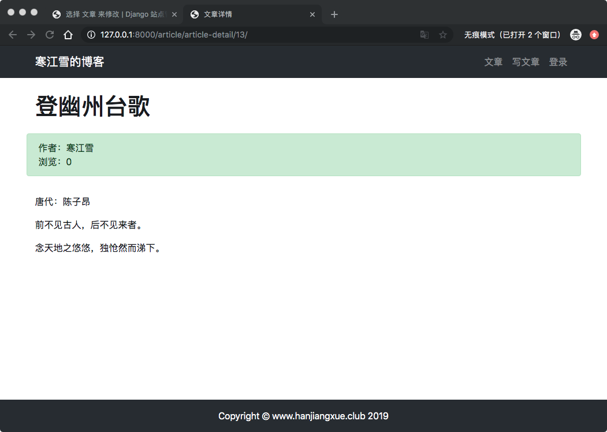
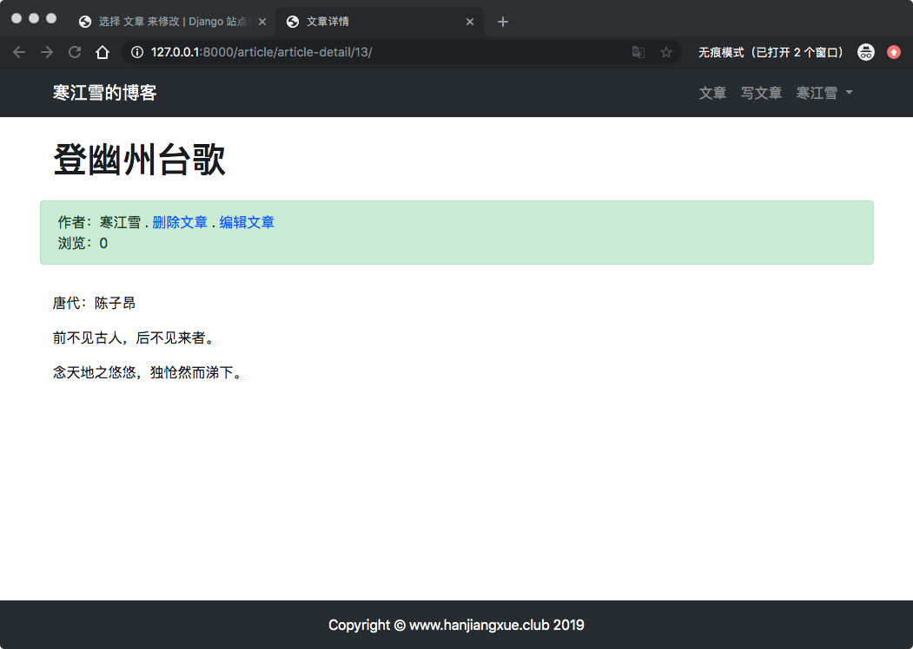
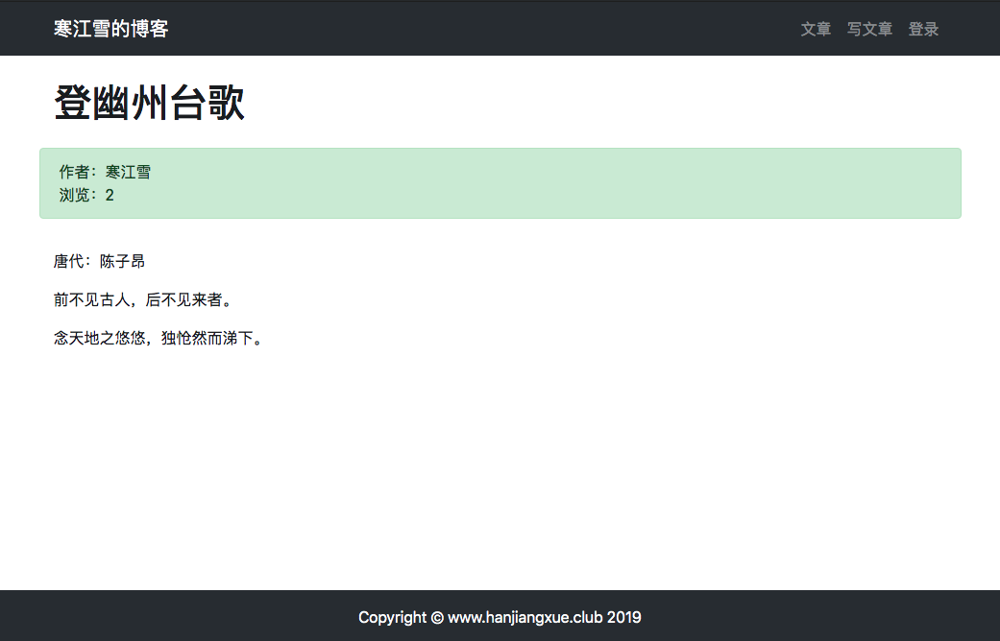
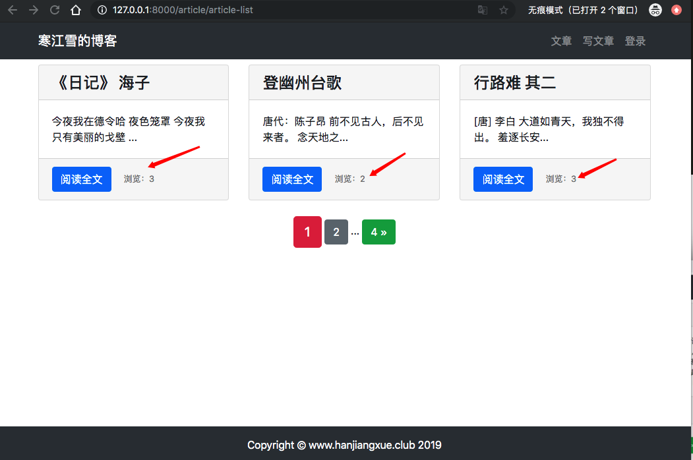

10、博客网站搭建十(文章分页，文章浏览量,热门文章)

## 10.1 文章分页
写一个完善的分页功能是有些难度的，好在[Django已经帮助你准备好了现成的分页模块](https://docs.djangoproject.com/zh-hans/2.1/topics/pagination/)。内置虽然简单，但是对于博客来说也是足够用了。

我们需要用到是`Paginator`.在`shell`中可以充分尝试它的用法。

```
(env) AdministratordeiMac:myblog administrator$ python manage.py shell
Python 3.7.2 (default, Feb 12 2019, 08:16:38) 
[Clang 10.0.0 (clang-1000.11.45.5)] on darwin
Type "help", "copyright", "credits" or "license" for more information.
(InteractiveConsole)

>>> from django.core.paginator import Paginator
>>> objects = ['1','2','3','4']
>>> p = Paginator(objects,2)
>>> p.count
4
>>> p.num_pages
2
>>> p.page_range
range(1, 3)
>>> page1 = p.page(1)
>>> page1
<Page 1 of 2>
>>> page1.object_list
['1', '2']
>>> 
>>> page2 = p.page(2)
>>> page2.object_list
['3', '4']
>>> page2.has_next()
False
>>> page2.has_previous()
True
>>> page2.has_other_pages()
True
>>> page2.previous_page_number()
1
>>> 

```

## 应用到项目中去
对文中分页，首先进入`article/views.py`，对`def article_list()`函数修改：

 ```
 ...
 from django.core.paginator import Paginator


# 文章列表
def article_list(request):
    # 取出所有的博客文章
    article_list = ArticlePost.objects.all()

    # 每页显示1篇文章
    paginator = Paginator(article_list, 1)

    # 获取url中的页面
    page = request.GET.get('page')

    # 将导航栏对象相应的页码内容返回给 articles
    articles = paginator.get_page(page)
    # 需要传递给模板（templates）的对象
    context = {'articles': articles}
    # render函数，载入模板并返回context对象
    return render(request, 'article/list.html', context)
    ...

 ```
 
> 通过视图中的`Paginator`类，给传递模板的内容做改动，返回的不再是所有的文章合集，而是对应的页码部分的文章对象，而且这个对象还包含了分页的方法。
> 
> 我们前面的文章已经接触到了一些将参数传递到视图的手段了：
> 
> * 通过POST请求将表单数据传递到视图
> * 通过url将地址中的参数传递到视图

这里用到了另一个方法，在GET请求中，在url的末尾附上`?key=value`的键值对，视图中就可以通过`reuqest.GET.get('key')`来查询`value`值。

进入`templates/articel/list.html`模板，在末尾`<div>`前面，加上分页内容：

```
...
...
{#页面导航#}
    <div class="paginator row">
        <div class="m-auto">
            <span class="step-links">
{#                如果不是第一页，则页码上显示翻页#}
                
                    <a href="?page=1" class="btn btn-success">&laquo;1</a>
                    <span>...</span>
                    <a href="?page={{ articles.previous_page_number }}" class="btn btn-secondary">{{ articles.previous_page_number }}</a>
                
{#            当前页面#}
            <span class="current btn btn-danger btn-lg">{{ articles.number }}</span>

{#            如果不是最末页，则显示翻页按钮#}
            
                <a href="?page={{ articles.next_page_number }}" class="btn btn-secondary">{{ articles.next_page_number }}</a>
                <span>...</span>
                <a href="?page={{ articles.paginator.num_pages }}" class="btn btn-success"> {{ articles.paginator.num_pages }} &raquo;</a>
            
            </span>

        </div>
    </div>
</div>
```
数显页面


自己点击一下看看，搞定收工。

## 10.2 统计文章浏览量
浏览量是甚多社交网站所必备的数据，足以显示其重要性。自己也可根据浏览量来评估某篇文章的受欢迎程度，读者也可以根据浏览量来筛选质量更高的文章。

然鹅，准确统计浏览量并不是一个简单事情：

* 某些请求不应该统计为浏览量，比如䢔自己的浏览或者对文章的编辑后的从定向。
* 由于用户众多，浏览的数据是客户都在快速更新，会给数据库带来很大的压力。因此很多大型网站都会使用[Redis](https://redis.io/)这样读写速度很快的内存库辅助的存储。

因为我们的项目是比克网站，先做个粗略的统计，后面用户多了可以再做优化。

## 模型
浏览量作为每篇博文都会有数据，需要一个字段来存储。进入`article/models.py`，作如下修改：

```
...
  # 统计浏览量
    total_views = models.PositiveIntegerField(default=0)
...    
```
> `PositiveIntegerField`用于存储正整数字段
> 
> `defaule=0`设定初始值为0

修改完模型，记得要迁移数据库，否则更改不会生效。


## 列表模板
添加浏览量在模板和详情页都要显示，首先进入`templates/article/list.html`：

```
...
...
 <div class="card-footer">
                        <a href="" class="btn btn-primary"> 阅读全文</a>
{#                        显示浏览量#}
                        <span>
                            <small class="col align-self-end" style="color: gray">浏览：{{ article.total.views }}</small>
                        </span>
                    </div>
...
...                    
```

## 详情模板
之类浏览量，前面这里为了快速跑起来，任何用户都可以编辑删除文章，这里不对的，所以我们现在再次修改这里，除了增加文章浏览量，添加权限，进入`article/detail.html`模板文件：

```
...
...
{#            标题及作者#}
            <h1 class="col-12 mt-4 mb-4">{{ article.title }}</h1>
            <div class="col-12 alert alert-success">
                <div>
                    作者：{{ article.author }}
                    
                        . <a href="#" onclick="confirm_delete()">删除文章</a>
                        . <a href="">编辑文章</a>
                    
                </div>
            <div>
                浏览：{{ article.total_views }}
            </div>
...
...            
```
启动服务刷新页面，用户未登录的状态或者不是作者本人：



登录之后，而且是文章作者：



## 视图
现在浏览量正确显示了，但是没有对结果做任何的处理，数值会一直是0，我们要修改随着浏览是数值递增。进入`article/views.py`,修改`article_detail()`:

```
...
# 文章详情
def article_detail(request, pk):
    # 取出所有文章
    article = ArticlePost.objects.get(pk=pk)
    
    # 浏览量+ 1
    article.total_views += 1
    article.save(update_fields=['total_views'])
...
```
> `update_files=[]`指定了数据库只更新`total_views`字段,优化执行效率。
点击几次之后，看看结果：



## 权限
前面说了，只是在模板中鉴定权限是不够的，必须在后端业务逻辑中再次验证用户身份，进入`article/views.py`更新`article_update()` 和`article_delete()`：

```
# 编辑文章
@login_required(login_url='userprofile/login/')
def article_update(request, pk):
...
...
    # 获取需要修改的具体文章对象
    article = ArticlePost.objects.get(pk=pk)
    
    # 过滤非作者用户
    if request.user != article.author:
        return HttpResponse('抱歉，你无权修改这篇文章')
...
...        
```

```
# 删除文章
@login_required(login_url='/userprofile/login/')
def article_delete(request, pk):
    # 根据对应的id去删除对应的文章
    article = ArticlePost.objects.get(pk=pk)
    # 过滤费作者用户
    if request.user != article.author:
        return HttpResponse('抱歉，你无权修改这篇文章')
...
...        
```
> 视图中进行了两次权限查看
> 
> * `login_required`装饰器过滤未登录用户
> * `if`语句过滤已经登录，但不是作者本人的用户

## 10.3 热门文章
有了浏览量之后，文章受欢迎的程度就有了评价，所以要根据浏览量对文章做一个排序，即显示热门文章。

现在应该已经很熟悉MTV模式了，按照这个套路来就可以了： 

* 文章模型已经有了，不需要写model
* 写一个视图函数`article_list_by_views()`,取出浏览排序后的文章
* 将文章对象传递模板，并进行渲染

简单来说，人们文章列表和普通文章列表不同之处，就是排序的方式不同而已。由于要考虑扩展性，万一哪天需要根据文章标题排序呢？万一还需要用户id排序、标签排序、收藏排序...不仅如此，就连路由urls.py都要跟着膨胀。代码会越来越臃肿且不可维护。

因此这里我们不创建新的视图和路由，而是将排序功能融合到已有的视图和路由中去。

## 视图
根据上面的需求，进入`atricle/views.py`,修改`article_list()`函数：

```
# 文章列表
def article_list(request):

    # 根据GET请求中查询条件
    # 返回不同的排序对象数组
    if request.GET.get('order') == 'total_views':
        article_list = ArticlePost.objects.all().order_by('-total_views')
        order = 'total_views'
    else:
        article_list = ArticlePost.objects.all()
        order = 'normal'

    # 每页显示1篇文章
    paginator = Paginator(article_list, 3)

    # 获取url中的页面
    page = request.GET.get('page')

    # 将导航栏对象相应的页码内容返回给 articles
    articles = paginator.get_page(page)
    # 需要传递给模板（templates）的对象
    context = {'articles': articles, 'order': order}
    # render函数，载入模板并返回context对象
    return render(request, 'article/list.html', context)
...
...
```
> * 前面使用GET请求传递单个参数。它也可以传递多个参数的，如`?a=1&b=2`,参数间隔用`&`隔开。
> * 视图根据GET参数`order`的值，来判断取出文章如何排序。
> * `order_by()`方法指定对象如何进行排序。模板中有`total_views`这个字段，因此`total_views`为正序，`-total_veiw`为倒序。
> * 为什么吧头疼的如