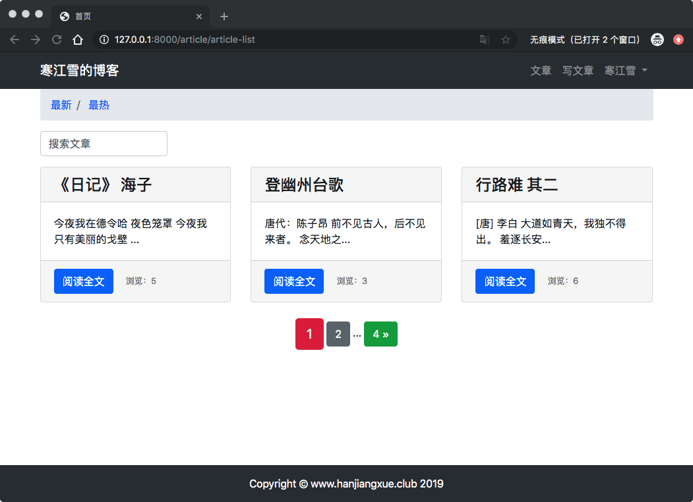
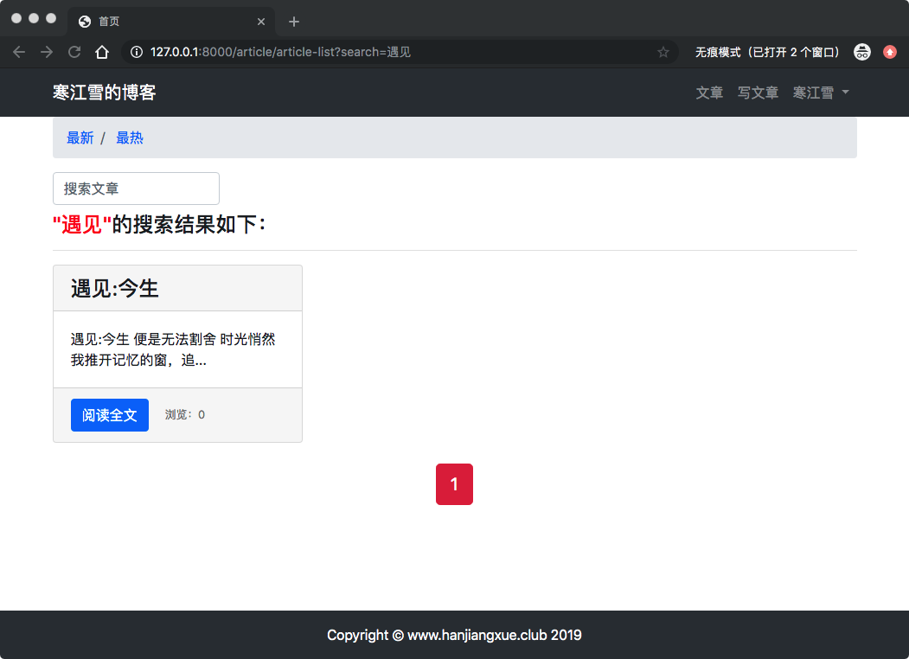
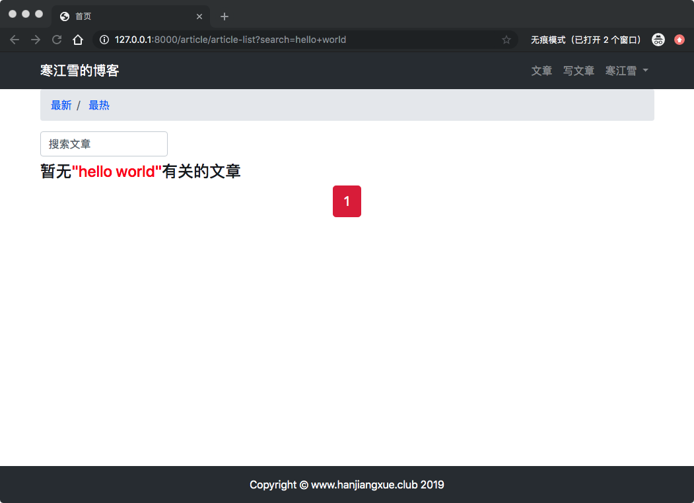
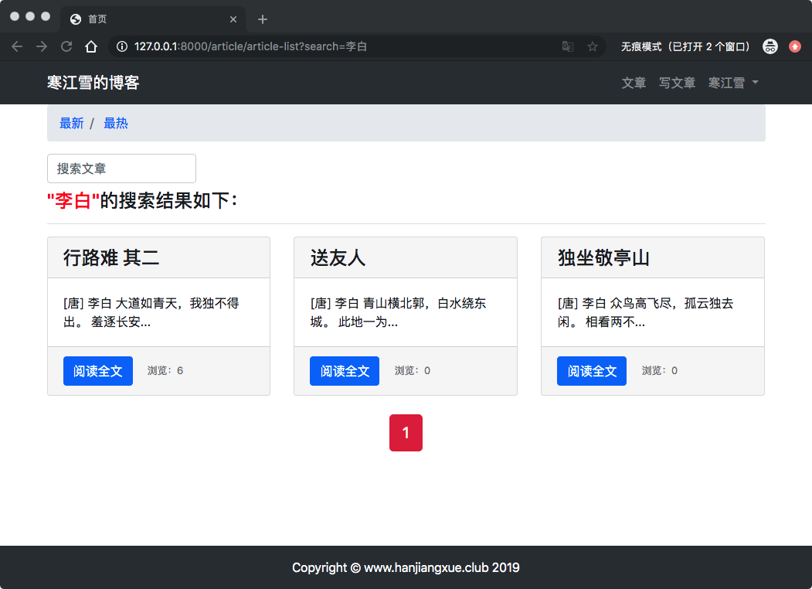
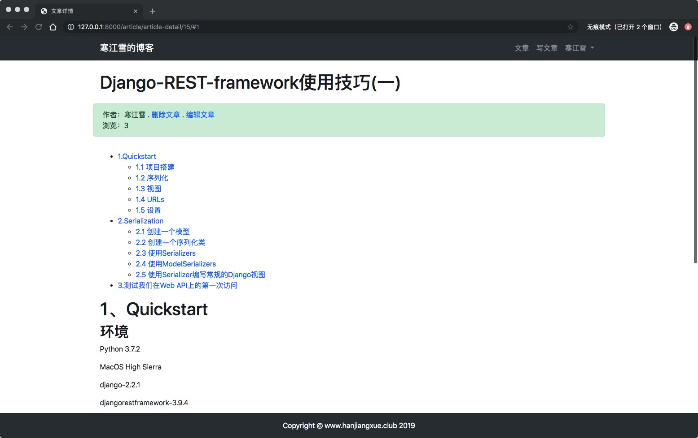
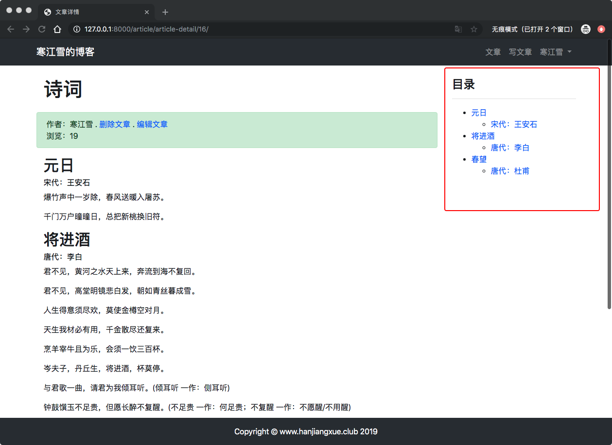

# 11、博客网站搭建十一(搜索文章、展示Markdown文章目录)

## 11.1 搜索文章
当你的网站有很多文章，或者有不同的分类的文章的时候，别人进来可能只是想查看某个方面的内容，他不能可能从开始看到最后才找到自己想要的内容，所以这时候就需要添加搜索的功能，方便快捷的定位到自己想找的内容。

尽管细节不同，但是搜索和列表还是有很多类似的地方的，首先是会检索出一些文章对象，然后列表中展示给用户。DRY(Don't Repeat Yourself)原则，使得我们在合理的原则下要充分复用代码。

我们希望搜索出来的文章也能够按照时间、热度、等方式进行排序。因此还需要构造一个新的参数`search`，能够和之前的`order`参数进行联合查询。

## GET或则POST？
用户搜索内容提交文本的时候，可以用GET请求提交，也可以用POST提交请求，根据具体情况选择。

因为`order`是用GET提交的，并且翻页是GET请求，因此选择GET方式提交搜索文本，可以方便的和之前的模块结合起来。

之情我们使用过表单组件`<form method='POST'>`，通过post请求提交数据，表单组件同样也可以提交GET请求，只要去掉`methods='POST'`属性就可以了。


## Q对象
`Model.objects.all()`能返回所有对象，对应的`model.objects.filter(**kwargs)`可以返回与给定参数匹配的部分对象。

还有`Model.objects.exclude(**kwargs)`返回与给定参数不匹配的对象。

如果对多个参数进行查询怎么办？比如同时查询文章标题和正文内容。这时候就需要Q对象。


## 视图
进入`article/views.py`，修改`article_list()`:

```
from django.db.models import Q


# 文章列表
def article_list(request):

    search = request.GET.get('search')
    order = request.GET.get('order')
    # 用户搜索逻辑
    if search:
        if order == 'total_views':
            # 用Q对象进行联合搜索
            article_list = ArticlePost.objects.filter(
                Q(title__icontains=search) |
                Q(body__icontains=search)
            ).order_by('-total_views')
        else:
            article_list = ArticlePost.objects.filter(
                Q(title__icontains=search) |
                Q(body__icontains=search)
            )
    else:
        # 将search参数置为空
        search = ''
        if order == 'total_views':
            article_list = ArticlePost.objects.all().order_by('-total_views')
        else:
            article_list = ArticlePost.objects.all()

    # 每页显示3篇文章，根据自己情况
    paginator = Paginator(article_list, 3)

    # 获取url中的页面
    page = request.GET.get('page')

    # 将导航栏对象相应的页码内容返回给 articles
    articles = paginator.get_page(page)
    # 需要传递给模板（templates）的对象
    context = {'articles': articles, 'order': order, 'search': search} # 添加search对象到context
```
> * 新增参数search，存放需要搜索的文本，若search为空，则检索特定的文章对象。
> * **filter中对Q的用法。**`Q(title_icontains=search)`意思是在模型的`title`字段查询，`icontains`是不区分大小写的包含，中间用个下划线隔开 。`search`是需要查询的文本。多个Q对象用管道符号`|`隔开，就达到了联合查询的目的。
> * `icontains`是不区分大小写，对应的`contains`表示区分大小写。
> * 为什么需要`search=''`语句？如果用户没有搜索操作，则`seach=request.GET.get('search')`会使得`search=None`，而这个值纯涤模板会错误的转成`None`字符串！等同于用户搜索`None`关键字，这个明显是错误的。

## 模板
进入`templates/article/list.html`,修改如下：

```
{# 定义放置文章标题的div容器#}
...
...
                <a href="?search={{ search }}">最新</a>
            </li>
            <li class="breadcrumb-item">
                <a href="?order=total_views&search={{ search }}">最热</a>
...
...

{# 新增搜索栏#}
    <div class="row">
        <div class="col-auto mr-auto">
            <form class="form-inline">
                <label class="sr-only">content</label>
                <input type="text" class="form-control mb-2 mr-sm-2" name="search" placeholder="搜索文章" required>
            </form>
        </div>
    </div>

{#新增搜索提示语#}
    
        
            <h4><span style="color: red">"{{ search }}"</span>的搜索结果如下：</h4>
            <hr>
        
            <h4>暂无<span style="color: red">"{{ search }}"</span>有关的文章</h4>
            
    

{#页面导航,添加href增加search参数#}
...
...
                    <a href="?page=1&order={{ order }}&search={{ search }}" class="btn btn-success">&laquo;1</a>
                    <span>...</span>
                    <a href="?page={{ articles.previous_page_number }}&order={{ order }}&search={{ search }}" class="btn btn-secondary">{{ articles.previous_page_number }}</a>
....
....
            
                <a href="?page={{ articles.next_page_number }}&order={{ order }}&seach={{ search }}" class="btn btn-secondary">{{ articles.next_page_number }}</a>
                <span>...</span>
                <a href="?page={{ articles.paginator.num_pages }}&order={{ order }}&search={{ search }}" class="btn btn-success"> {{ articles.paginator.num_pages }} &raquo;</a>
            
...
...
```
> * 面包屑组件、页码组件都改动了href：增加了search参数
> * 新增搜索栏，以GET请求提交search参数；required属性阻止用户提交空白文本
> * 新增搜索提示语。好的UI必须让用户了解当前的状态

启动服务，刷新页面：



搜索一下试试：







**搞定收工**

## 11.2 展示Markdown文章目录

一片文章，特别是长文如果没有目录将会是很头疼的，因为你不知道那些是你想看的，哪些是可以不用看的，所以我们现在就去添加目录。

之前我们已经添加支持MarkDown语法了，现在继续增加其强大的功能。进入`article/views.py`，进行如下的修改：

```
# 文章详情
def article_detail(request, pk):
...
...
    # 将Markdown语法渲染成HTML的样式
    article.body = markdown.markdown(article.body,
                                     extensions=[
                                         # 包含缩写，表格等常用扩展
                                         'markdown.extensions.extra',
                                         # 语法高亮扩展
                                         'markdown.extensions.codehilite',
                                         # 目录扩展 新增
                                         'markdown.extensions.toc',
                                     ])
```

> 把`'markdown.extension.TOC'`扩展添加进去了。`TOC`即Table Of Contents目录的意思。
> 
> 然后你可以在文中的任何地方插入`[TOC]`字符串，目录就自动生成好了

写入Markdown编辑的文章，进入详情页：



## 任意位置的目录
上面的方法只能将目录插入到文章中，如果想把目录插入到页面的任何一个位置呢？只需要修改Markdown渲染的方法就可以了呢：

进入`article/views.py`,作如下修改：

```
# 文章详情
def article_detail(request, pk):
    # 取出所有文章
    article = ArticlePost.objects.get(pk=pk)

    # 浏览量+ 1
    article.total_views += 1
    article.save(update_fields=['total_views'])

    # 将Markdown语法渲染成HTML的样式
    md = markdown.Markdown(
        extensions=[
            # 包含缩写，表格等常用扩展
            'markdown.extensions.extra',
            # 语法高亮扩展
            'markdown.extensions.codehilite',
            # 目录扩展
            'markdown.extensions.toc',
        ]
    )
    # 新增了md.toc对象
    article.body = md.convert(article.body)
    
    # 需要传递给模板的对象
    context = {'article': article, 'toc': md.toc}
    # 载入模板，并返回context对象
    return render(request, 'article/detail.html', context)
```
> 为了能将toc单独提取出来，我们先将Markdown类赋值给一个临时变量md，然后用convert()方法将正文渲染为html页面。通过md.toc将目录传递给模板。
> 
> 注意`markdown.markdown()`和`markdown.Markdown()`的区别 .更详细的解释见：[官方文档](https://python-markdown.github.io/extensions/toc/).

为了将新的目录渲染到页面中去，我们需要修改模板，进入`templates/article/detail.html`:

```
{#文章详情    #}
 <div class="container">
        <div class="row">
        // 将原有内容嵌套进新的div中
            <div class="col-9">
				...
				...
            </div>
{#        新增目录#}
            <div class="col-3 mt-4">
                <h4><strong>目录</strong></h4>
                <hr>
                <div>
                    {{ toc|safe }}
                </div>
            </div>
        </div>
 </div>

```
> * 重新布局，将原有的内容装进`col-9`的容器中，将右侧`col-3`的空间留给目录。
> * `toc`需要`|safe`标签才能正确渲染。

刷新页面会看到如下内容:


收工。