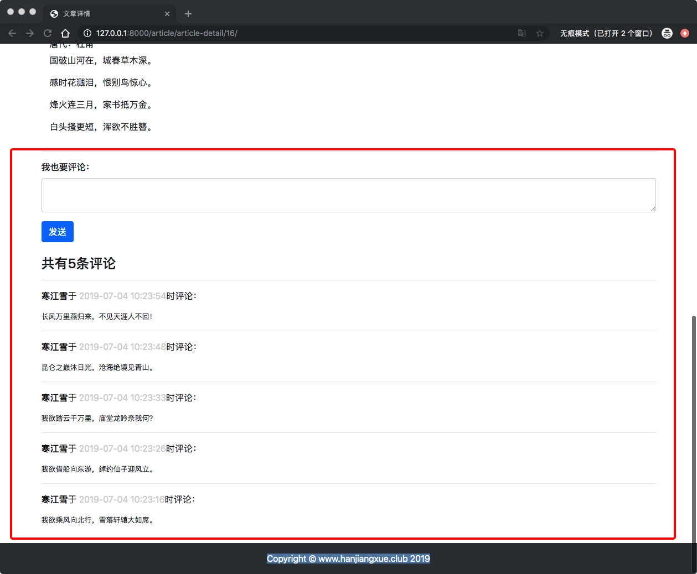
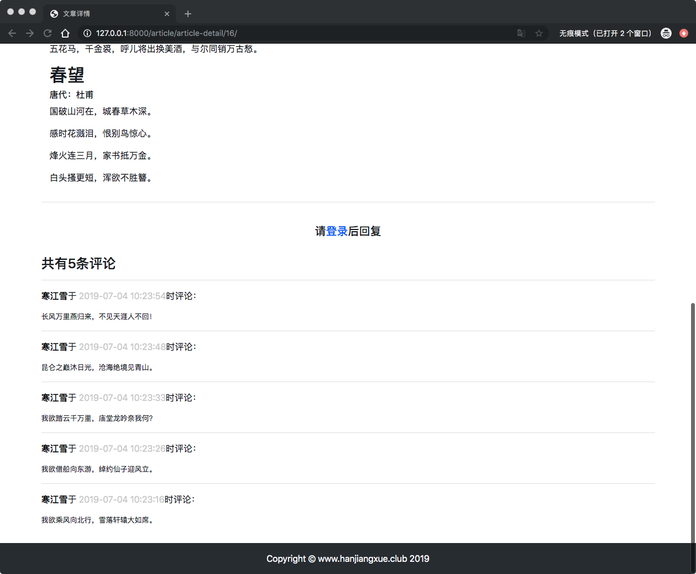

# 12、博客网站搭建十二(发表评论)
 
## 12 发表评论
评论是一个相对独立的功能，所以我们需要单独新建一个APP：

	(env) AdministratordeiMac:myblog administrator$ python manage.py startapp comment

> 有的人觉得奇怪，没有博文就没有评论，为什么说评论是“独立”的功能？
> 那是因为不仅博文可以评论，照片、视频甚至网站本身都可以“被评论”。将其封装成单独的模块方便以后的扩展。 

创建完评论APP之后，在`mysite/setting.py`中注册；

```
INSTALLED_APPS = [
...
...
    'comment',
]
```

进入`mysite/urls.py`修改跟路由：

```
urlpatterns = [
...
...
    path('comment/', include('comment.urls', namespace='comment')),
]
```

## 评论模型
进入`comment/models.py`:

```
from django.db import models
from django.contrib.auth.models import User
from article.models import ArticlePost


# 博文评论
class Comment(models.Model):
    article = models.ForeignKey(ArticlePost, on_delete=models.CASCADE, related_name='comments')
    user = models.ForeignKey(User, on_delete=models.CASCADE, related_name='comments')
    body = models.TextField()
    created = models.DateTimeField(auto_now_add=True)
    
    class Meta:
        ordering = ('-created',)
        
    def __str__(self):
        return self.body[:20]
```
> 模型中有两个外键：
> 
> * `article`是评论的文章
> * `user`是评论的发布者
> 
> 另外`related_name`理解[点击这里](https://www.douban.com/group/topic/29857899/)
> 
> 每次修改model记得，迁移数据。

## 评论的表单
用户提交时候会用到表单，因此新建表单类,进入`comment/forms.py`：

```
from django import forms
from .models import Comment


class CommentForm(forms.ModelForm):
    class Meta:
        model = Comment
        fields = ['body']
        
```

## 评论URL
在comment中新进路由文件`urls.py`,进入`commment/urls.py`新建文件路由：

```
from django.urls import path
from . import views

app_name = 'comment'

urlpatterns = [
    # 发表评论
    path('post-comment/<int:article_pk>', views.post_comment, name='post_comment'),
]
```
> 评论必须关联在某篇具体的博文里面，因此需要传入博文`id`,方便后面使用。
> 
> `post_comment()`视图函数还没有写，先取名占用一个位置。

## 评论的视图
进入`comment/views.py`,写入一下函数：

```
from django.shortcuts import render, get_object_or_404, redirect
from django.contrib.auth.decorators import login_required
from django.http import HttpResponse
from article.models import ArticlePost
from .forms import CommentForm


# 评论文章
@login_required(login_url='/userprofile/login')
def post_comment(request, article_pk):
    article = get_object_or_404(ArticlePost, pk=article_pk)
    
    # 处理POST请求
    if request.method == 'POST':
        comment_form = CommentForm(request.POST)
        if comment_form.is_valid():
            new_comment = comment_form.save(commit=False)
            new_comment.article = article
            new_comment.user = request.user
            new_comment.save()
            return redirect(article)
        else:
            return HttpResponse('表单内容有误，请重新填写。')
    #处理错误请求
    else:
        return HttpResponse('发表评论仅接受POST请求。')

```

> `get_object_or_404()`，它和`Model.objects.get()`的功能基本是相同的。区别在于在生成环境下，如果用户请求一个不存在的对象，`Model.objects.get()`会返回`Error 500`的错误（无服务内部错误），而`get_objects_or_404`会返回`Error 404`.相比之下，会返回404错误更加准确。
> 
> `redirect()`:返回到一个合适的url中，即用户发表完评论之后，重新定向到文章详情页面。当其参数是一个model对象时，会自动调用这个model的对象`get_absolute_url()`方法。因此接下来马上修改`article`模型。

## 文章模型
按照上面说的，在文章模型中天津爱`get_absolute_url()`方法：

```
from django.urls import reverse
...
...
   def get_absolute_url(self):
        return reverse('article:article_detail', args=[self.pk])
...
```
> 通过`reverse()`方法返回文章详情页面的url，实现路由重定向。

## 文章详情视图
评论模块需要在文章详情页面展示，所以必须把评论模块也传递到模板中。因此修改`article/views.py`中的`articel_detail()`:

```
...
from comment.models import Comment

# 文章详情
def article_detail(request, pk):
    # 取出所有文章
    article = ArticlePost.objects.get(pk=pk)
    
    # 取出文章评论
    comments = Comment.objects.filter(article=pk)
...
...

    # 需要传递给模板的对象
    context = {'article': article, 'toc': md.toc, 'comments': comments}
    ...
    ...
```
> `fileter()`可以取出多个满足条件的对象，而`get()`只能取出1个，注意区分。

## 文章详情模板
进入`templates/article/detail.html`:

```
# 正文
   </div>
   ...
	</div>
	{#        目录#}
        <div class="col-3 mt-4">
...
        </div>
	
{#        发表评论#}
        <hr>
        
            <div>
                <form action="" method="post">
                    
                    <div class="form-group">
                        <label for="body"><strong>我也要评论：</strong></label>
                        <textarea type="text" class="form-control" id="body" name="body" rows="2"></textarea>
                    </div>
{#                    提交按钮#}
                    <button type="submit" class="btn btn-primary">发送</button>
                </form>
            </div>
            <br>
        
            <br>
            <h5 class="row justify-content-center">请<a href="">登录</a>后回复</h5>
            <br>
        

{#        显示评论#}
        <h4>共有{{ comments.count }}条评论</h4>
        <div>
            
                <hr>
                <p>
                    <strong style="color: black"> {{ commment.user }}</strong>于
                    <span style="color: lightgray">{{ commment.created|date:'Y-m-d H:i:s' }}</span>时评论：
                </p>
                <pre style="font-family: inherit; font-size: small">{{ commment.body }}</pre>
            
        </div>

```
> * 表单组件的`action`指定了数据提交到哪个url
> * 显示评论中的`commments.count`是模板对象中的内置方法，对包含的元素进行计数
> * `|date:"Y-m-d H:i :s"`管道符号，用于给对象粘贴某些属性或者功能。这里属于格式化日期的显示方式。
> * `<pre>`定义格式化文本，在我们的项目中的作用就是保留空格和换行符。该标签会改变文字的字体，大小等，因此用`style`属性重新定义相关的内容。

启动服务，刷新页面；



退出登录之后：



> 数据的删、改功能我们已经做过很多遍，这里不打算再赘述了。评论同样也可以支持Markdown语法，或者插入Emoji表情符号。等到基本功能全部完成，再回头来优化吧。

