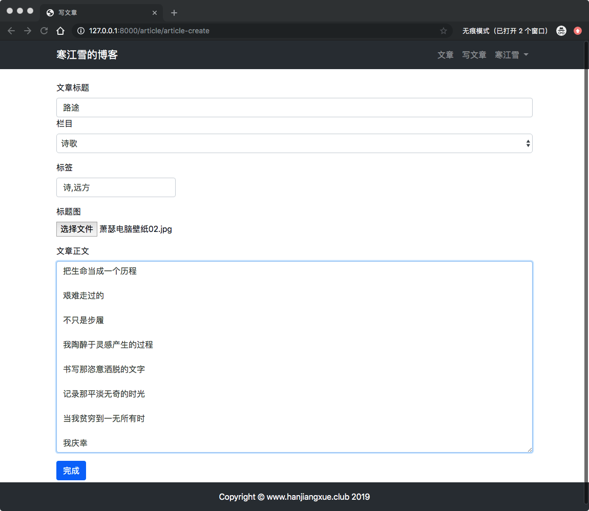
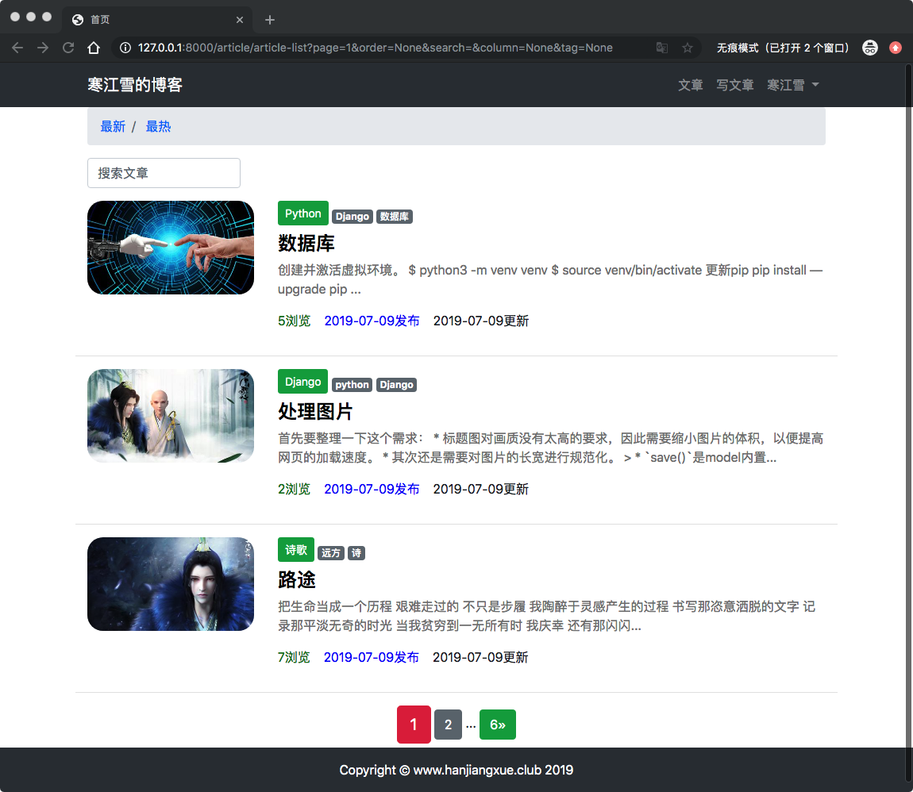
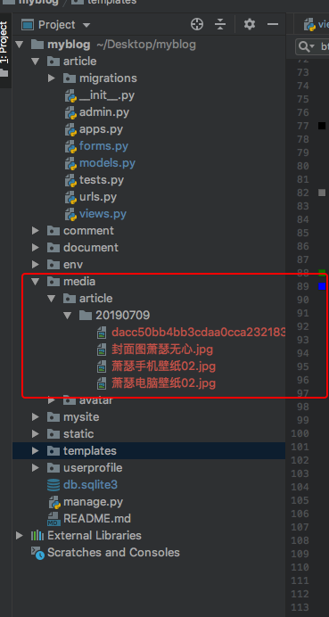

# 15、博客网站搭建十五(文章添加标题图片)

## 15.1 文章添加标题图片
与用户头像类似，标题图是属于每篇博文自己的资产，因此需要修改**model**，新建一个字段，进入`article/models.py`,修改如下：

```
# 博客文章数据模型
class ArticlePost(models.Model):
...
    # 文章标题图
    avatar = models.ImageField(upload_to='article/%Y%m%d',blank=True)
    ...
```
> 上传地址中的`%Y%m%d`是日期格式的写法，比如上传时间为2019年7月9日，则标题图还会上传到`media/article/20190709`这个目录中。记得迁移数据。

标题图通常在创建新文章的时候就已经设置好了，而新的文章是通过表单上传到数据库中的。因此接下来修改发表文章的表单类，进入`article/forms.py`:

```
# 写文章的表单类

class ArticlePostForm(forms.ModelForm):

    class Meta:
        # 指明数据模型的来源
        model = ArticlePost
        # 定义表单包含的字段
        fields = ('title', 'body', 'tags', 'avatar')

```

然后修改视图，因为POST的表单中包含了图片文件，所以将`request.FILES`也一并绑定到表单类中，否则图片无法保存。进入`article/views.py`：

```
# 写文章的视图
@login_required(login_url='/userprofile/login/')
def article_create(request):
    # 判断用户是否提交数据
    if request.method == 'POST':
        # 将提交的数据赋值到表单实例中
        article_post_form = ArticlePostForm(request.POST, request.FILES)
        ...
```

## 处理图片
首先要整理一下这个需求：

* 标题图对画质没有太高的要求，因此需要缩小图片的体积，以便提高网页的加载速度。
* 其次还是需要对图片的长宽进行规范化。

下一个问题是，代码应该写到什么地方呢？似乎在model、form或者view里处理图片都可以。在这里我打算把代码写到model中去，这样不管你在任何地方上传图片（包括后台中！），图片都会得到处理。进入`article/models.py`:

```
    # 文章标题图
    avatar = models.ImageField(upload_to='article/%Y%m%d',blank=True)

    # 保存时候处理图片
    def save(self, *args, **kwargs):
        # 调用原有的save（）的功能
        article = super(ArticlePost, self).save(*args, **kwargs)

        # 固定宽度缩放图片大小
        if self.avatar and not kwargs.get('update_fields'):
            image = Image.open(self.avatar)
            (x, y) = image.size
            new_x = 400
            new_y = int(new_x * (y/x))
            resized_image = image.resize((new_x, new_y), Image.ANTIALIAS)
            resized_image.save(self.avatar.path)
         return article  
```

> * `save()`是model内置的方法，他会在model实例每次保存是调用，这个改写就是要把图片的逻辑'塞进去'。
>*  `super(ArticlePost, self).save(*args, **kwargs)`的作用是调用父类原有的`save()`方法，即将`model`中的字段数据保存到数据库中。因为图片处理是基于已经保存的图片，所以这句话一定要在处理图片之前执行，否则会找不到原始图片的错误。
> * 博文的标题图不是必须的，`if`中的`self.avatar`删除掉没有标题图的的文章，这些文章不需要处理图片。
> * `if`中的这个`not kwargs.get('update_fields')`.还记得`article_detail()`视图中为了统计流量而调用了`save(update_fields)=['total_views']`吗？那里就是为了排除掉统计流量而调用`save()`，免得每次用户进入文章详情页面都要处理标题图，影响性能。 (这种判断方法虽然简单，但会造成模型和视图的紧耦合。以后优化的时候可以选择更优雅的方法，比如专门设置一个参数，用来判断是哪类视图调用了save()。)
> * 接下来都是`Pillow`处理图片的流程：打开原始图片，取得分辨率，将图片的宽度设置为400并根据比例缩小图片，最后用新的图片将原始图片覆盖掉.`Image.ANTIALIAS`表示缩放采用平滑波。
> * 最后一步，将父类`save()`返回的结果原封不动的返回去。

## 模板与测试
修改发表文章的模板，让表单能够上传图片，进入`templates/article/create.html`:

```
{#            提交文章的表单#}
            <form method="POST" action="", enctype="multipart/form-data">
...
{#                文章标题图#}
                <div class="form-group">
                    <label for="avatar">标题图</label>
                    <input type="file" class="form-control-file" name="avatar" id="avatar">
                </div>
```
> `enctype="multipart/form-data"`这个属性的意思是表单提交时不对字符编码。表单里带有文件时，一定要加上它。

然后修改文章列表，让其能够展示标题图，然后稍微调整一下列表循环的架构，进入`templates/article/list.html`:

```
...
      <div class="row mt-2">

          
              
{#              标题图#}
              
                  <div class="col-3">
                    
                  </div>
              
{#            文章内容#}
           <div class="col">

...
...
           </div>
            <hr style="width: 100%;">
          
...
...
```

下面启动服务，数显页面：




查看一下media目录下实际保存的图片：



还有一些细节需要优化，有些功能还没有添加，这些后面优化在做吧。先收工。

