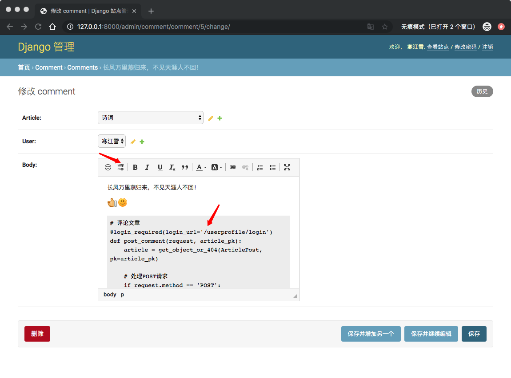
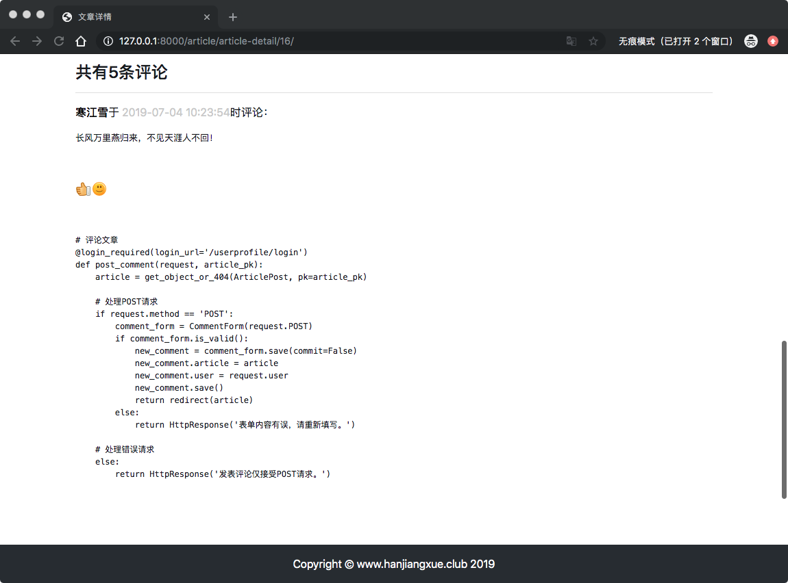
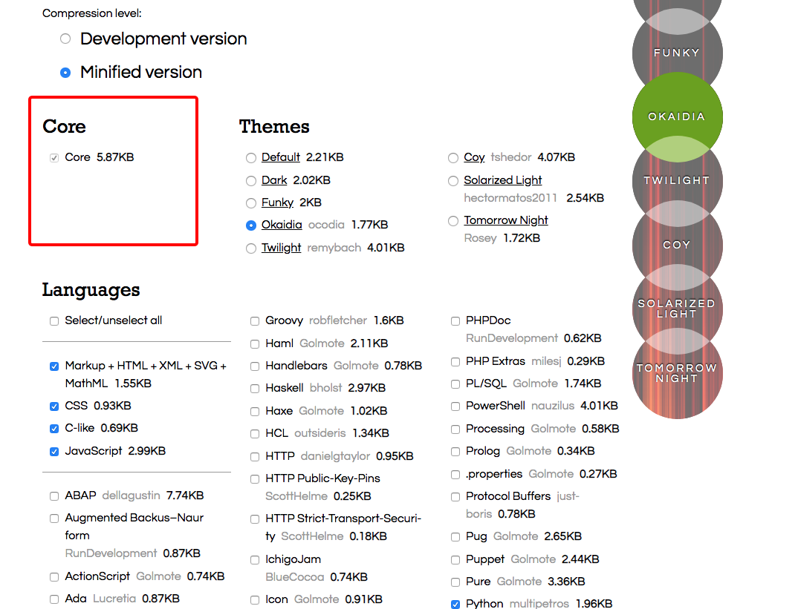
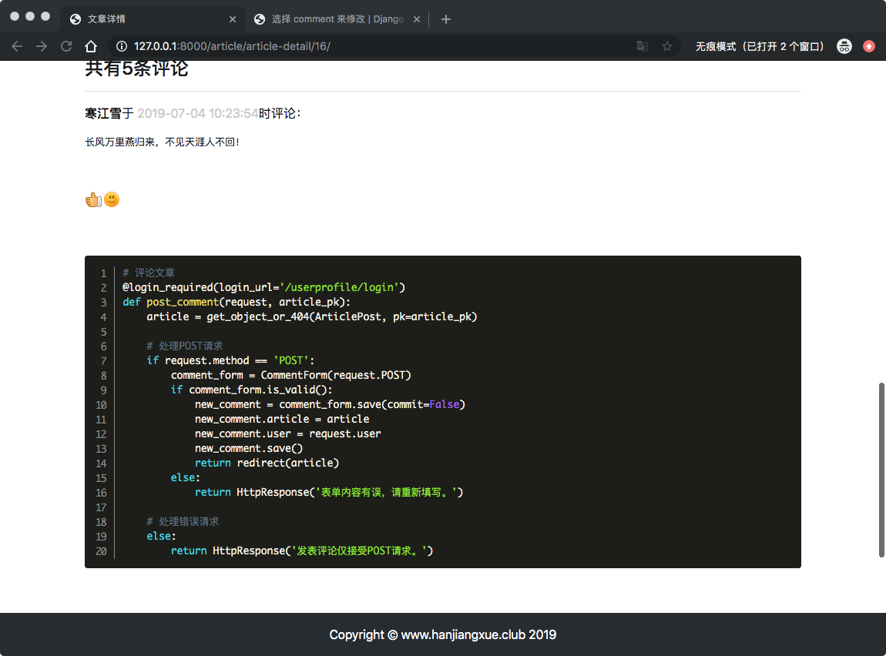
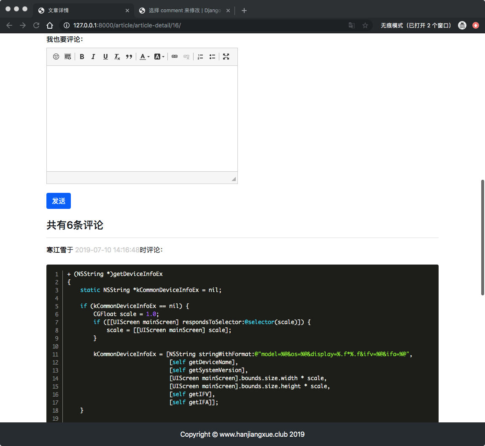
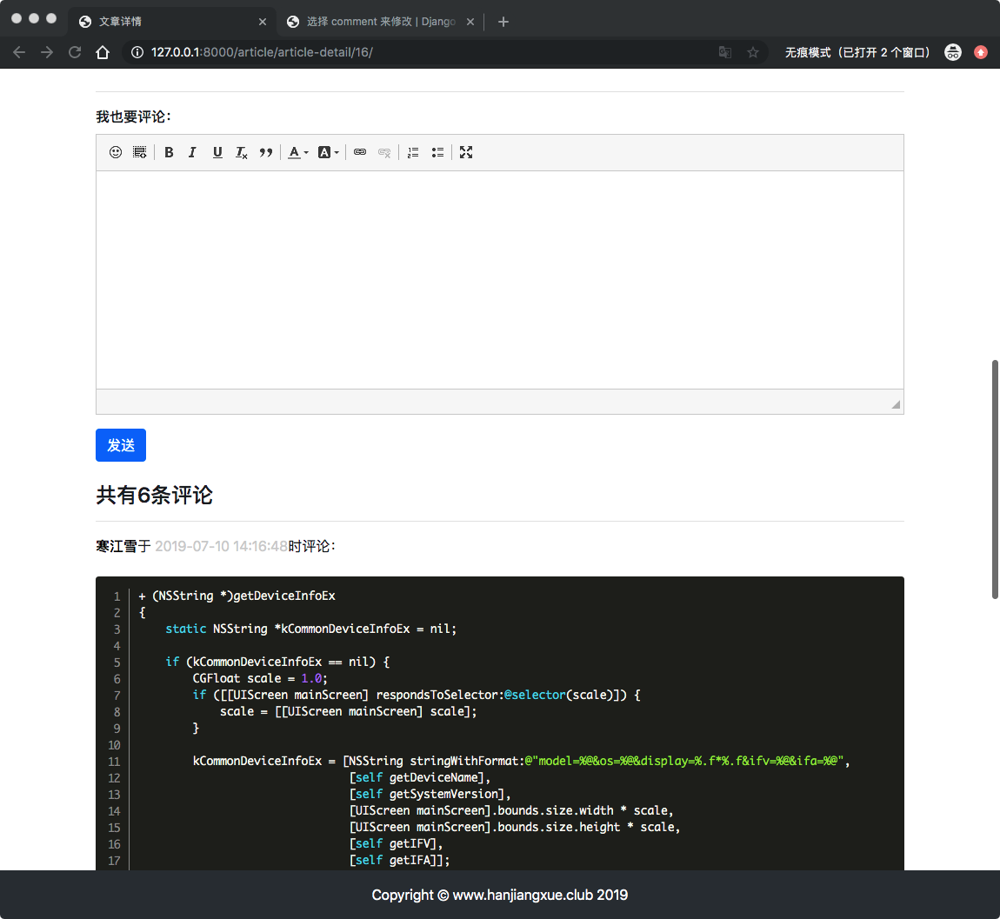

# 16、博客网站搭建十六(评论使用富文本)
前面已经实现了用Markdown语法写文章了，但是文章的评论用Markdown就不太合适了，你不能请求别人去熟悉这个语法，另外评论中通常还有表情、带字体的颜色德国功能，这些是Markdown不具备的。

因此富文本编辑器就派上用场了，开源的三方比较常见的有[kindeditor](http://kindeditor.net/demo.php), [simditor](https://github.com/istommao/django-simditor), [django-ckeditor](https://github.com/django-ckeditor/django-ckeditor)等还有其他的一些，根据自己的喜好去选择吧。

这里使用[django-ckeditor](https://github.com/django-ckeditor/django-ckeditor)富文本编辑器。

##在后台使用ckeditor
进入虚拟环境，安装ckeditor
	
	(env) AdministratordeiMac:myblog administrator$ pip install django-ckeditor

安装成功然后再setting.pu中注册app：

```
INSTALLED_APPS = [
 ...
    'ckeditor',
]
```

然后接下来修改模型，用`django-ckeditor`库自己的富文本字段`RichTextField`替换普通文本字段`TextField`，进入`comment/models.py`:


```
# 博文评论
class Comment(models.Model):
...
    body = RichTextField()
...

```
> 记得每次修改模型要迁移数据

为了方便测试，修改`comment/admin.py`文件，将评论模块注册到后台中：

```
from django.contrib import admin
from .models import Comment

admin.site.register(Comment)

```
启动服务，进入后台评论页面,然后可以看到：


> 功能相当齐全，字体、字号、颜色、链接、表情应有尽有。
> 
> 如果我们只需要部分功能怎么办呢？比如插入flash动画就用不到，另外似乎也没看到插入代码块的功能。

`ckeditor`允许你在`setting.py`中进行自定义配置，进入`mysite/setting.py`文件：

```
...
CKEDITOR_CONFIGS = {
    # django-ckeditor默认使用default配置
    'default': {
        # 编辑器宽度自适应
        'width':'auto',
        'height':'250px',
        # tab键转换空格数
        'tabSpaces': 4,
        # 工具栏风格
        'toolbar': 'Custom',
        # 工具栏按钮
        'toolbar_Custom': [
            # 表情 代码块
            ['Smiley', 'CodeSnippet'], 
            # 字体风格
            ['Bold', 'Italic', 'Underline', 'RemoveFormat', 'Blockquote'],
            # 字体颜色
            ['TextColor', 'BGColor'],
            # 链接
            ['Link', 'Unlink'],
            # 列表
            ['NumberedList', 'BulletedList'],
            # 最大化
            ['Maximize']
        ],
        # 加入代码块插件
        'extraPlugins': ','.join(['codesnippet']),
    }
}
...
```
在`toolbar_Custom`中定义需要使用的功能模块；没列出的功能就不再显示了。代码块功能是编辑器自带的插件，需要在`extraPlugins`中指定使用。效果如下：



编辑富文本搞定后，还需要在前台界面中展示出来。富文本是以类似`html`的格式进行保存的，因此还需要展示评论的代码加入`|safe`过滤器，防止浏览器进行转义。

进入`templates/article/detail.html`中修改部分代码：

```
{#        显示评论#}
...
                <pre style="font-family: inherit; font-size: small">{{ commment.body|safe }}</pre>
            
...
```
数显页面如下：



## 代码高亮
代码高亮需要额外添加插件**Prism**，在[Prism](https://ckeditor.com/cke4/addon/prism)插件官方网页下载（也可以直接点击[这里下载](https://download.ckeditor.com/prism/releases/prism_1.0.1.zip)）,将解压出来的`prism`放到`evn\lib\site-packages\ckeditor\static\ckeditor\ckeditor\plugins`目录下。注意`evn`是你创建的虚拟环境（之前安装的库都在这个目录中）。

然后再[Prism官网](https://prismjs.com/download.html#themes=prism-okaidia&languages=markup+css+clike+javascript+python&plugins=line-numbers)选择主题。



>选择自己喜欢的主题，最下面有一个预览
>
> * 根据喜好选择一个喜欢的主题
> * 然后选择需要高亮的语言。不清楚就可以全选
> * 勾选行号插件
> * 最后点击DOWNLOAD CSS下载样式

在`static`目录中新建`prism`目录，将下载好的CSS文件放进去。
> 注意之类的static是项目中的静态文件目录（与前面的章节相同）,而不是evn中的static目录

然后再需要代码高亮的模板文件中引用prism的静态文件，对代码进行渲染，进入`templates/article/detail.html`:

```
...
<script src=""></script>
<link rel="stylesheet" href="">
...
```
将Prism、widget、lineutils插件添加到配置文件中。后面两个编辑器自带，不用单独下载，添上就可以了：

```

CKEDITOR_CONFIGS = {
...
        # 加入代码块插件
        'extraPlugins': ','.join(['codesnippet', 'prism', 'widget', 'lineutils']),
    }
}
```
刷新页面,看到如下：



## 在前台使用ckeditor
为了让用户在前台也能使用富文本编辑器，还得对代码稍微改动，首先需要把评论的表单传递到文章详情页面中，所以进入`article/views.py`,修改`article_detail`视图：

```
...
   # 引入评论表单
    comment_form = CommentForm()

...

    # 需要传递给模板的对象
    context = {'article': article, 'toc': md.toc, 'comments': comments, 'comment_form': comment_form}
    ...
```

进入`templates/article/detail.html`,将`detail.html`原来评论表单的正文部分即`<textarea>`替换如下，

```
...
            <div>
                <form action="" method="post">
                    
                    <div class="form-group">
                        <label for="body"><strong>我也要评论：</strong></label>
                        <div>
                            {{ comment_form.media }}
                            {{ comment_form.body }}
                        </div>
                    </div>
                    ...
```


## 宽度自适应
首先在配置文件中将宽度设置为`auto`，这一步我们已经做好了。

CKeditor编辑器本身有一个`inline-block`的样式，阻碍了自适应的效果，需要用`Jquery`语法将其清除掉，进入`templates/article/detail.html`，在详情页底部加入代码：

```
...
<script>
    $(".django-ckeditor-widget").removeAttr("style");
</script>    


```
> `$`代表JQuery语句，这话的意思是：找到页面中`class='django-ckeditor-widget'`的容器，然后删除这个容器的`style`属性。
> 
> 好像没有什么问题，但是注意这个JQuery语句，那么就要求在运行之前就先载入`jquery.js`。然而在渲染页面的时候。包含`$`语句的``会插入到`base.html`模板的`jquery.js`之前，导致语句不会生效，并且控制台报错会报出`$ is not define`的错误。
> 
> > 比较容易想到的办法是将引入Jquery.js的标签提到更顶部的位置，在block模板插入前就加载。这样做的问题是JS文件加载通常较慢，它会阻塞后面的代码，从而减缓页面整体加载速度。本文不采用这种办法。

解决方案是在`base.html`中新增一个专门用于拼接`JavaScript`脚本的位置，命令为``.注意必须放置在`Jquery`标签的后面，进入`templates/base.html`：

```
...
{#layer插件依赖jquery才能正常工作#}
    <script src=""></script>
{#引入layer.js#}
    <script src=""></script>
        # 新增
</body>
```

然后将`detail.html`中的JS代码放到这个块中：

```

<script>
    $(".django-ckeditor-widget").removeAttr("style");
</script>
    
```

然后刷新页面，就会看到评论宽度已经自适应了：



搞定收工。