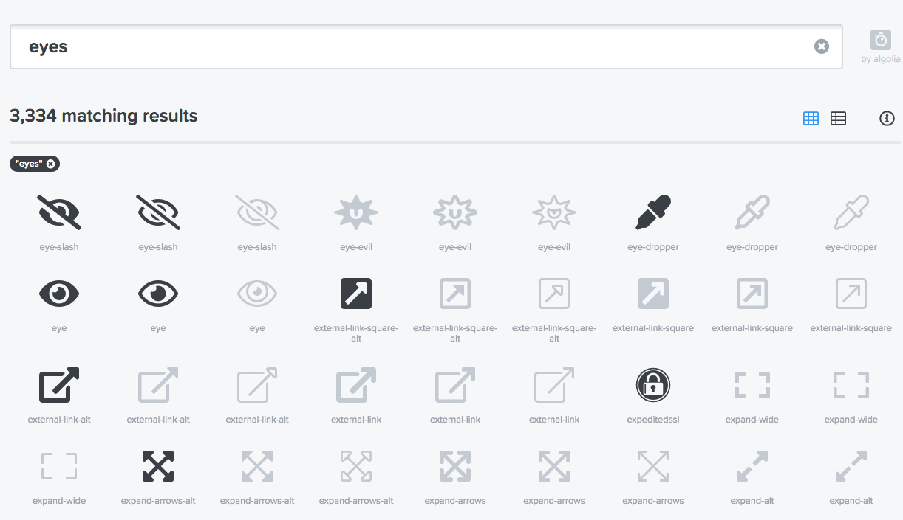
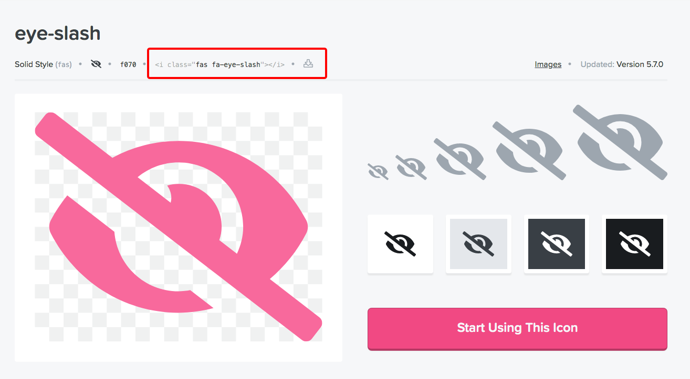
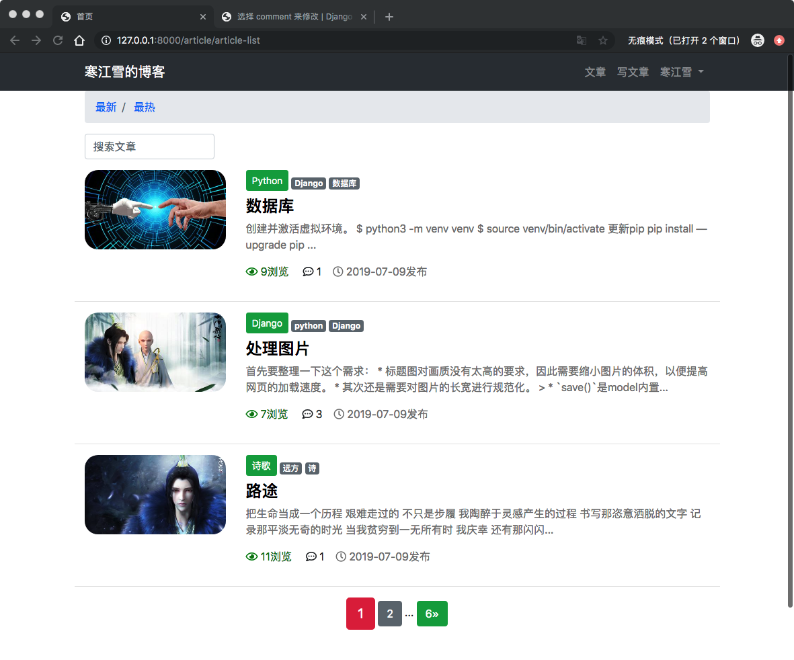
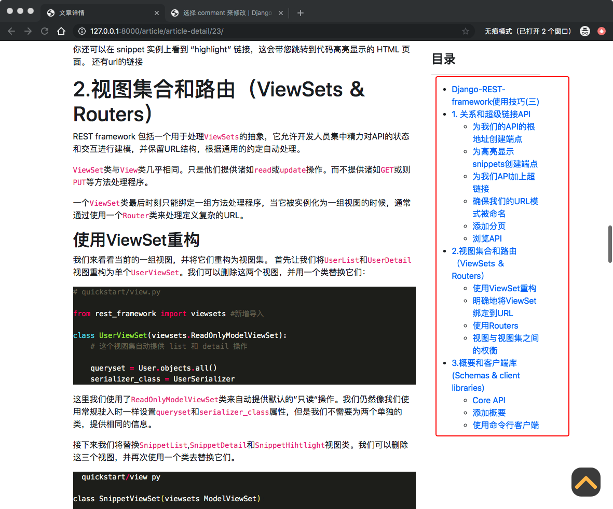

# 17、博客网站搭建十七(悬浮按钮、矢量图标、页脚沉底、粘性侧边栏)

## 17.1 回到顶部浮动按钮
当用户读完文章后，可能想回到文章的开头从新去读，或者审视其中某些内容，当然文章目录也是可以满足部分功能。如果仅仅是想回到顶部，当页面很长，用户仅仅是想回到顶部，就需要一个按钮，点击按钮就直接回到顶部。这个功能Boostrap4似乎没有提供，所以我们就自己写一个也不复杂。

在`templates`目录新建`back_to_top.html`文件，写入一下代码：

```
<button type="button" id="BackTop" class="topTop-arrow" style="z-index: 100;"></button>

<script>
    {#向上滚动的函数#}
    $(function () {
        $('#BackTop').click(function () {
            $('html,body').animate({scroll:0}, 500);
        });
        $(window).scroll(function () {
            if ($(this).scrollTop() > 300){
                $('#BackTop').fadeIn(300);
            } else {
                $('#BackTop').stop().fadeOut(300);
            }
        }).scroll();
    });
</script>


<style>
    {#按钮边框大小、位置、样式#}
    .topTop-arrow {
        width: 3.5rem;
        height: 3.5rem;
        padding: 0;
        margin: 0;
        border: 0;
        border-radius: 33%;
        opacity: 0.7;
        background: black;
        cursor: pointer;
        position: fixed;
        right: 1.5rem;
        bottom: 1.5rem;
        display: none;
    }
    
    {#绘制按钮中的向上的箭头#}
    .topTop-arrow::before, .topTop-arrow::after {
        width: 31px;
        height: 7px;
        border-radius: 3px;
        background: orange;
        position: absolute;
        content: '';
    }
    
    .topTop-arrow::before {
        transform: rotate(-45deg) translate(0, -50%);
        left: 0.4rem;
    }
    
    .topTop-arrow::after {
        transform: rotate(45deg) translate(0, -50%);
        right: 0.4rem;
    }
    
    {#取消点击按钮的聚焦#}
    .topTop-arrow:focus {
        outline: none;
    }
</style>
```

> 代码分为`html`,`javascript`,`css`三部分。
> 
> **HTML**部分只有一行，用button标签表示浮动按钮容器。
> 
> **JavaScript**部分主要用到了**Jquery**的语法，页面加载完成后开始监听两个事件：

> * 用户点击浮动按钮时候，将页面滚动到顶部。
> * 当页面滚动的时候，根据页面距离顶部的距离，再决定按钮的显示或者隐藏。
> 
> **CSS**部分最长但是也是最简单，主要定义了按钮的位置、大小、图案等样式。

核心代码就写好了，有点小瑕疵的就是前面在`footer.html`中定义了`class='fixed-bottom'`,这个属性的显示层级很高，会将浮动按钮给覆盖掉，因此删除`templates/footer.html`中的`fixed-bottom`的属性：

```
...
<footer class="py-3 bg-dark">
    <div class="container">
        <p class="m-0 text-center text-white">Copyright &copy; www.hanjiangxue.club 2019</p>
    </div>
</footer>
```
>z-index这个css样式决定了页面中容器的显示顺序，数值越大则显示优先级越高。之所以fixed-bottom会覆盖掉浮动按钮，就是因为它将z-index设置成了一个很大的数值。

因为我们想在全站都拥有这个按钮，所以讲刚写好的模板引用到`base.html`中，进入`templates/base.html`:

```
{#layer插件依赖jquery才能正常工作#}
    <script src=""></script>
{#引入浮标按钮#}
    
```
> 注意模块用到了Jquery，因此要在Jquery后面引入


> 然后点击按钮就可以回到顶部了。

## 17.2 矢量图标
与老版本不同，Bootstrap4 中没有自带图标。作为补偿，官方也推荐了几强大而且免费的第三方矢量图标提供商。比如阿里的[阿里云矢量图库](https://www.iconfont.cn/)，或者[fontawesome](https://fontawesome.com/).有付费的，有免费的，不过免费的也足够用了。

我们以fontawesome为例，用法很简单，你甚至都不用下载到本地，根据官网提示，直接在`base.html`中引入：

```
{#引入矢量图#}
    <link rel="stylesheet" href="https://use.fontawesome.com/releases/v5.8.1/css/all.css", 
          integrity="sha384-50oBUHEmvpQ+1lW4y57PTFmhCaXp0ML5d60M1M7uH2+nqUivzIebhndOJK28anvf",
          crossorigin="anonymous"
    >
```
然后再页面中插入摸个图标的标签就可以用了。

首先在[官网图标库](https://fontawesome.com/icons?d=gallery)搜索想要的图标，比如eye：



点击进去之后，就可以看到他的标签：



> 将此标签名称复制到你的网页中，图标就会渲染出来。
> 
> 很神奇的是，矢量图标跟普通的字体是完全类似的，你可以通过CSS定义图标的颜色(color)、大小(font-size)等样式。

选择你喜欢的，将图标代码添加到`templates/article/list.html`中的列表循环：

```
...
<P>
{#                    附加信息#}
                    <span style="color: green">
                        <i class="far fa-eye"></i>
                        {{ article.total_views }}浏览&nbsp;&nbsp;&nbsp;&nbsp;
                    </span>
                    <span>
                        <i class="far fa-comment-dots"></i>
                        {{ article.comments.count }}&nbsp;&nbsp;&nbsp;
                    </span>
                    <span style="color: blue">
                        <i class="far fa-clock"></i>
                        {{ article.created_time|date:'Y-m-d' }}发布&nbsp;&nbsp;&nbsp;
                    </span>
{#                    <span style="color: -moz-mac-accentdarkestshadow">{{ article.update_time|date:'Y-m-d' }}更新</span>#}
</P>
...
```

刷新页面，看到如下效果：



## 17.3 页脚沉底
刚才做浮动按钮的时候，取消了页脚固定在底部的`fixed-bottom`。

当页面内容较少时候，页脚下方居然空出来一大块地方，太丑了。[《Sticky Footer, Five Ways》](https://css-tricks.com/couple-takes-sticky-footer/)罗列了5种方法解决这个问题，有兴趣的童鞋可以深入了解一下。

我们需要修改`base.html`和`footer.html`两个文件。

```
...
{#引入导航栏#}
    
    <div id="wrapper">
{#预留页面的位置#}
         
        <div id="push"></div>
    </div>
...
{#引入注脚#}
    
    <style>
        html, body {
            height: 100%;
            margin: 0;
        }
        #wrapper {
            min-height: 100%;
            margin-bottom: -60px;
        }
        
        #footer,
        #push {
            height: 60px;
        }
    </style>
...    
```
进入`templates/footer.html`:

```
<footer ... id="footer">
    ...
</footer>
```
>代码通过CSS样式控制页面尺寸不小于屏幕的的高度，以及页脚的高度为60px
>
>* `#push`容器留出一段与页脚等高的空隙，避免正文内容与页脚重叠。
>* `#wrapper`容器的底部有一个负边框，作用是给页脚容器让出位置，这个负边距不设置也可以，无非就是底部多出高度为60px的空白罢了。
>
> 这里HTML，JS，CSS都没有分开写，最好的代码结构还是要分开的，现在内容比较少，后面再说吧。

## 17.4 粘性侧边栏
目前教程将文章目录放置在文章的右侧，这就是相当于是个侧边栏，问题是当用户向下读文章的时候，目录却不会固定在页面中，而是几下就翻的不见了呢，影响体验。

粘性侧边栏就是来解决这个问题的。当页面向下滚动的时候，粘性侧边栏会灵活的固定在屏幕中，保证用户在任何位置都可以看到侧边栏中的内容。

考虑到侧边栏有可能会很长，因此设计出足够“聪明”的粘性侧边栏也不那么容易。教程将用到[Abouolia](https://github.com/abouolia)的[粘性侧边栏插件](https://github.com/abouolia/sticky-sidebar)，强大且小巧，读者可以去[官方示例](https://abouolia.github.io/sticky-sidebar/)感受一下。

将插件的[GitHub](https://github.com/abouolia/sticky-sidebar)库下载本地后，因为博客项目已经加载好了`jquery`,所以只需要在`dist`目录下的`jquery.sticky-sidebar.min.js`这个文件就可以了。在项目`static`目录下新建目录`sticky_sidebar`，将其粘贴进去：

因为主需要在文章详情页面用到，所以在详情页中引入模块就够了，进入`templates/article/detail.html`:

```
...
        {#        目录#}
            <div class="col-3 mt-4 sidebar" id="sidebar">
                <div class="sidebar__inner">
                     <h4><strong>目录</strong></h4>
                    <hr>
                    <div>
                    {{ toc|safe }}
                </div>
                </div>
            </div>
...            
...
{#    你先行侧边栏样式#}
<style>
    .sidebar{
        will-change: min-height;
    }

    .sidebar__inner{
        transform: translate(0, 0);
        transform: translate3d(0, 0 ,0);
        will-change: position, transform;
    }
</style>    

...
...

    
{#引入粘性侧边栏    #}
<script src=""></script>
<script type="text/javascript">
    $('#sidebar').stickySidebar({
        topSpacing:20,
        bottomSpacing:20,
    })
</script>    
<script>
    $(".django-ckeditor-widget").removeAttr("style");
</script>

```
> 按照插件的要求，侧边栏套上了两层容器，第一层含有属性`id="sidebar" class="sidebar"`，第二层含有属性`class="sidebar__inner"`。然后设置样式，引入静态文件并调用插件，没什么好说的，照做就可以了。与前面的章节相同，由于插件需求Jquery，一定要把 JavaScript 语句放到``中，否则会报错哦。
> 
> 插件还有其他设置，详见[官方文档](https://abouolia.github.io/sticky-sidebar/).

刷新页面，不关你怎么滚动，目录都会在屏幕中间，而且随着滚轮自然的上下移动了：



搞定收工。