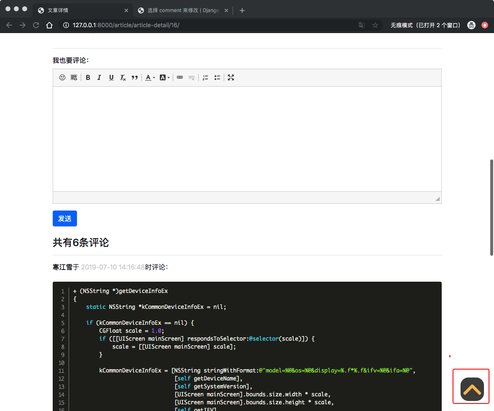

17、博客网站搭建十七

# 17.1 回到顶部浮动按钮
当用户读完文章后，可能想回到文章的开头从新去读，或者审视其中某些内容，当然文章目录也是可以满足部分功能。如果仅仅是想回到顶部，当页面很长，用户仅仅是想回到顶部，就需要一个按钮，点击按钮就直接回到顶部。这个功能Boostrap4似乎没有提供，所以我们就自己写一个也不复杂。

在`templates`目录新建`back_to_top.html`文件，写入一下代码：

```
<button type="button" id="BackTop" class="topTop-arrow" style="z-index: 100;"></button>

<script>
    {#向上滚动的函数#}
    $(function () {
        $('#BackTop').click(function () {
            $('html,body').animate({scroll:0}, 500);
        });
        $(window).scroll(function () {
            if ($(this).scrollTop() > 300){
                $('#BackTop').fadeIn(300);
            } else {
                $('#BackTop').stop().fadeOut(300);
            }
        }).scroll();
    });
</script>


<style>
    {#按钮边框大小、位置、样式#}
    .topTop-arrow {
        width: 3.5rem;
        height: 3.5rem;
        padding: 0;
        margin: 0;
        border: 0;
        border-radius: 33%;
        opacity: 0.7;
        background: black;
        cursor: pointer;
        position: fixed;
        right: 1.5rem;
        bottom: 1.5rem;
        display: none;
    }
    
    {#绘制按钮中的向上的箭头#}
    .topTop-arrow::before, .topTop-arrow::after {
        width: 31px;
        height: 7px;
        border-radius: 3px;
        background: orange;
        position: absolute;
        content: '';
    }
    
    .topTop-arrow::before {
        transform: rotate(-45deg) translate(0, -50%);
        left: 0.4rem;
    }
    
    .topTop-arrow::after {
        transform: rotate(45deg) translate(0, -50%);
        right: 0.4rem;
    }
    
    {#取消点击按钮的聚焦#}
    .topTop-arrow:focus {
        outline: none;
    }
</style>
```

> 代码分为`html`,`javascript`,`css`三部分。
> 
> **HTML**部分只有一行，用button标签表示浮动按钮容器。
> 
> **JavaScript**部分主要用到了**Jquery**的语法，页面加载完成后开始监听两个事件：

> * 用户点击浮动按钮时候，将页面滚动到顶部。
> * 当页面滚动的时候，根据页面距离顶部的距离，再决定按钮的显示或者隐藏。
> 
> **CSS**部分最长但是也是最简单，主要定义了按钮的位置、大小、图案等样式。

核心代码就写好了，有点小瑕疵的就是前面在`footer.html`中定义了`class='fixed-bottom'`,这个属性的显示层级很高，会将浮动按钮给覆盖掉，因此删除`templates/footer.html`中的`fixed-bottom`的属性：

```
...
<footer class="py-3 bg-dark">
    <div class="container">
        <p class="m-0 text-center text-white">Copyright &copy; www.hanjiangxue.club 2019</p>
    </div>
</footer>
```
>z-index这个css样式决定了页面中容器的显示顺序，数值越大则显示优先级越高。之所以fixed-bottom会覆盖掉浮动按钮，就是因为它将z-index设置成了一个很大的数值。

因为我们想在全站都拥有这个按钮，所以讲刚写好的模板引用到`base.html`中，进入`templates/base.html`:

```
{#layer插件依赖jquery才能正常工作#}
    <script src=""></script>
{#引入浮标按钮#}
    
```
> 注意模块用到了Jquery，因此要在Jquery后面引入



