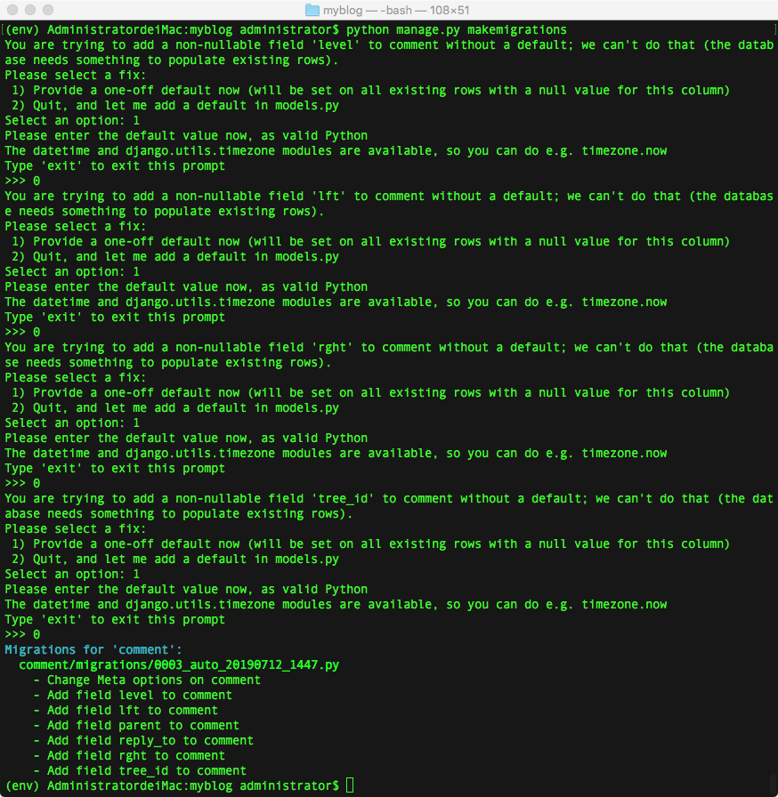
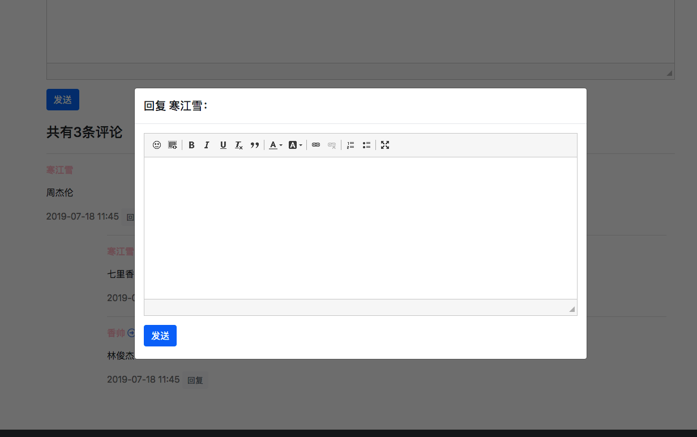

# 18、博客网站搭建十八(实现多级评论功能)

## 18.1 实现多级评论功能
多级评论意味着你需要将模型重新组织为**树形结构**。‘树根’是一级评论，而众多的‘树叶’则是次级评论。这里使用第三方库[django-mptt](https://github.com/django-mptt/django-mptt)

django-mptt模块包含了树形数据结构以及查询、修改树形数据的众多方法。任何需要树形结构的地方，都可以用 django-mptt 来搭建。比如目录。

## 重构模型
既然要建立树形结构，老的评论肯定是要修改的。首先安装`django-mptt`：

	(env) AdministratordeiMac:myblog administrator$ pip install django-mptt

安装成功后，在配置中注册：

```
INSTALLED_APPS = [
	...
    'mptt',
]
```

接下来，修改评论模型：

```
...

# 博文评论
class Comment(MPTTModel):
...
    # mptt树形结构
    parent = TreeForeignKey(
        'self',
        on_delete=models.CASCADE,
        null=True,
        blank=True,
        related_name='children'
    )

    # 记录二级评论回复给谁, str
    reply_to = models.ForeignKey(
        User,
        null=True,
        blank=True,
        on_delete=models.CASCADE,
        related_name='replyers'
    )
    
    class MPTTMeta:
        order_insertion_by = ['-created']
...        
```
> 引入`MPTT`相关模块，然后改动一下几个位置：
> 
> * 模型不能再继承自`models.Model`类，替换`MPTTModel`,因此你的模型自动拥有几个用于树形算法的新字段,（可以在数据迁移完之后在SQL工具中查看）
> * `parent`字段是必须定义的，用于存储数据之间的关系，不要去修改它。
> * `reply_to`外键用于存储评论人。
> * 将`class Meta`替换为`class MPTTMeta`,参数也有小的变化，这是模块的默认定义，实际功能是相同的。

这些改动大部分是[`django-mptt`文档的默认设置](https://django-mptt.readthedocs.io/en/latest/tutorial.html).需要说明的是这个`reply_to`.

可以考虑一下，多级评论是否允许无限级数？无限级数听起来很美好，但是套嵌层级如果过多，反而会导致结构的混乱，并且难以排版。所以这里就限制评论最多只能两级，超过两级的评论一律重置为两级，然后再将实际的被评论人存储在`reply_to`字段中。

>举例说明：一级评论人为 a，二级评论人为 b（parent 为 a），三级评论人为 c（parent 为 b）。因为我们不允许评论超过两级，因此将 c 的 parent 重置为 a，reply_to 记录为 b，这样就能正确追溯真正的被评论者了。

模型修改完了，添加了很多非空的字段进去，多以最好先清除所有的评论数据，再进行数据迁移。

迁移时出现下面的提示也不要慌，一律选第 1 项、填入数据 0 就可以了：



## 视图
前面章节已经写过一个视图`post_comment`用于处理评论了，我们将复用它：进入`comment/views.py`做一个重构:


```
from .models import Comment


# 评论文章
@login_required(login_url='/userprofile/login')
def post_comment(request, article_pk, parent_comment_id=None):
    article = get_object_or_404(ArticlePost, pk=article_pk)

    # 处理POST请求
    if request.method == 'POST':
        comment_form = CommentForm(request.POST)
        if comment_form.is_valid():
            new_comment = comment_form.save(commit=False)
            new_comment.article = article
            new_comment.user = request.user
            
            
            # 二级回复
            if parent_comment_id:
                parent_comment = Comment.objects.get(id=parent_comment_id)
                # 若回复层级超过两级，则转换为二级
                new_comment.parent_id = parent_comment.get_root().id
                # 被回复人
                new_comment.reply_to = parent_comment.user
                new_comment.save()
                return HttpResponse('200 OK')
            
            new_comment.save()
            return redirect(article)
        else:
            return HttpResponse('表单内容有误，请重新填写。')
     
    elif request.method == 'GET':
        comment_form = CommentForm()
        context = {
            'commnet_form' : comment_form,
            'article_id' : article_pk,
            'parent_comment_id': parent_comment_id
        }
        return render(request, 'comment/replay.html',context)

    # 处理错误请求
    else:
        return HttpResponse('发表评论仅接受POST请求。')

```
> * 视图参数新增了`parent_comment_id=None`.此参数代表父评论的`id`值,若为`None`则表示评论为一级评论，若有具体则为多级评论。
> * 如果视图处理的是多级评论，则用`MPTT`的`get_root()`方法将其父级重置为属性结构最底部的一级评论，然后在`reply_to`中保存实际的被回复人并保存。视图最终返回的是`HTTPResponse`字符串，后面会用到。
> * 新增处理GET请求逻辑，用于给二级回复提供空白表单，后面会用到。

现在视图中有一个`pattern_comment_id`参数用于区分多级评论，因此就要求有`url`传入参数，有的不传，就像下面的这样，进入`commment/urls.py`:

```
urlpatterns = [
    # 发表评论 处理以及回复
    path('post-comment/<int:article_pk>', views.post_comment, name='post_comment'),
    # 处理二级回复
    path('post-comment/<int:article_pk>/<int:parent_comment_id>', views.post_comment, name='comment_reply')
]
```
> 两个`path`都使用了同一个视图函数，但是传入的参数确是不一样的，第一个`path`没有`parent_commnet_id`参数，因此视图就使用了缺省值`None`,达到区分评论层级的目的。

## 前端渲染
在前端逻辑上

* 二级回复同样要使用富文本编辑器
* 回复时候不能离开当前页面
* 多个CKeditor加载时候，不嫩共有性能问题

首先要对`detail.html`的代码要重构，主要集中在显示评论部分以及相关的`JavaScript`.

```
<!-- 改动 显示评论 部分 -->
<!-- 不要漏了 load mptt_tags！ -->

<h4>共有{{ comments.count }}条评论</h4>
<div class="row">
    <!-- 遍历树形结构 -->
    
        <!-- 给 node 取个别名 comment -->
        
            <div class="
                        offset-1 col-11
                        
                        col-12
                        "
            >
                <hr>
                <p>
                    <strong style="color: pink">
                        {{ comment.user }}
                    </strong> 

                    
                        <i class="far fa-arrow-alt-circle-right" 
                           style="color: cornflowerblue;"
                        ></i>
                        <strong style="color: pink">
                            {{ comment.reply_to }}
                        </strong> 
                    

                </p>
                <div>{{ comment.body|safe }}</div>

                <div>
                    <span style="color: gray">
                        {{ comment.created|date:"Y-m-d H:i" }}
                    </span>

                    <!-- 加载 modal 的按钮 -->
                    
                    <button type="button" 
                            class="btn btn-light btn-sm text-muted" 
                            onclick="load_modal({{ article.id }}, {{ comment.id }})"
                            >
                        回复
                    </button>
                    
                    <a class="btn btn-light btn-sm text-muted" 
                       href=""
                       >
                        回复
                    </a>
                    
                </div>

                <!-- Modal -->
                <div class="modal fade" 
                     id="comment_{{ comment.id }}" 
                     tabindex="-1" 
                     role="dialog" 
                     aria-labelledby="CommentModalCenter" 
                     aria-hidden="true"
                >
                    <div class="modal-dialog modal-dialog-centered modal-lg" role="document">
                        <div class="modal-content" style="height: 480px">
                            <div class="modal-header">
                                <h5 class="modal-title" id="exampleModalCenterTitle">回复 {{ comment.user }}：</h5>
                            </div>
                            <div class="modal-body" id="modal_body_{{ comment.id }}"></div>
                        </div>

                    </div>
                </div>

                
                    <div class="children">
                        {{ children }}
                    </div>
                
            </div>


        
    
</div>

...


...

<!-- 新增代码，唤醒二级回复的 modal -->
<script>
    // 加载 modal
    function load_modal(article_id, comment_id) {
        let modal_body = '#modal_body_' + comment_id;
        let modal_id = '#comment_' + comment_id;

        // 加载编辑器
        if ($(modal_body).children().length === 0) {
            let content = '<iframe src="/comment/post-comment/' + 
                article_id + 
                '/' + 
                comment_id + 
                '"' + 
                ' frameborder="0" style="width: 100%; height: 100%;" id="iframe_' + 
                comment_id + 
                '"></iframe>';
            $(modal_body).append(content);
        };

        $(modal_id).modal('show');
    }
</script>

```
这里东西很多，我们慢慢分解来看：

## 遍历树
第一个问题？如何遍历树形结构？
django-mptt提供了一个快捷方式：

```

<ul>
	
		<li>
			{{ node.your_field }}
			
				<ul class='childre'>
					{{ childre}}
				</ul>
				
		</li>
		
</ul>
```
> 内部实现先不用去管，当成一个黑盒子去使用.`objs`是需要遍历的数据集，`node`是其中的单个数据。
> 
> * ``不要忘记加载
> * `node`这个变量名太宽泛了，用``给它起个别名

## Modal
Modal是Boostrap内置的弹窗。本文代码如下：

```
<!-- 加载 modal 的按钮 -->

<button type="button" 
        class="btn btn-light btn-sm text-muted" 
        onclick="load_modal({{ article.id }}, {{ comment.id }})"
        >
    回复
</button>

<a class="btn btn-light btn-sm text-muted" 
   href=""
   >
    回复
</a>


<!-- Modal -->
<div class="modal fade" 
     id="comment_{{ comment.id }}" 
     tabindex="-1" 
     role="dialog" 
     aria-labelledby="CommentModalCenter" 
     aria-hidden="true"
     >
    <div class="modal-dialog modal-dialog-centered modal-lg" role="document">
        <div class="modal-content" style="height: 480px">
            <div class="modal-header">
                <h5 class="modal-title" id="exampleModalCenterTitle">回复 {{ comment.user }}：</h5>
            </div>
            <div class="modal-body" id="modal_body_{{ comment.id }}"></div>
        </div>
    </div>
</div>

```
> 这几乎就是[官网的一段代码](https://getbootstrap.com/docs/4.1/components/modal/)。有点不同的是本文没有用原生的的按钮，而是用`JavaScript`加载Modal；还有就是增加了几个容器的`id`属性，方便后面的`JavaScript`查询。
> 
> 和之前章节用`Layer.js`相比，`Bootstrap`的弹窗更笨重些，也更精致，很适合在这里使用。
> 
> 注意，在加载Modal的按钮用模板语法``对用户登录做了区分，目的是将未登录的用户引导至登录页面。

## 加载Modal
这段是加载Modal是`JavaScript`代码：

```

// 加载 modal
function load_modal(article_id, comment_id) {
    let modal_body = '#modal_body_' + comment_id;
    let modal_id = '#comment_' + comment_id;

    // 加载编辑器
    if ($(modal_body).children().length === 0) {
        let content = '<iframe src="/comment/post-comment/' + 
            article_id + 
            '/' + 
            comment_id + 
            '" frameborder="0" style="width: 100%; height: 100%;"></iframe>';
        $(modal_body).append(content);
    };

    $(modal_id).modal('show');
}
```
> 实际上核心逻辑只有3步：
> 
> * 点击回复按钮时候唤醒了`load_modal()`函数，并将文章id,父级评论id传递进去。
> * `$(modal_body).append(content)`找到对应的Modal容器，并将一个`iframe`容器动态添加进去。
> * `$(modal_id).modal('show')`找到对应的Modal，并将其唤醒

为什么iframe要动态加载？这是为了避免潜在的性能问题，你确实可以在页面初始化时候把所有的`iframe`都渲染好，但是这是需要花费额外的时间，并且绝大部分的Modal用户根本不会用到，很不划算。

if语句的作用是判断Modal中如果已经加载过了，就不再重复加载了。

最后，什么是`iframe`? 这是HTML5中的新特性，可以理解成当前网页中嵌套的另一个独立的网页。既然是独立的网页，那自然也会独立的向后台请求数据。仔细看`src`中的请求位置，正是前面我们在`urls.py`中写好的第二个path。即对应了`post_comment`视图中的GET逻辑：

```
comment/views.py

def post_comment(request, article_id, parent_comment_id=None):
    ...
    # 处理 GET 请求
    elif request.method == 'GET':
        ...
        return render(request, 'comment/reply.html', context)
    ...
```

视图返回`comment/reply.html`模板还没写，下面把他写好。

## Ajax提交表单

在`templates`中新建`comment`目录，并新建`reply.html`，写入代码：

```
{#载入静态文件#}


<!DOCTYPE html>
<html lang="en">
<head>
    <meta charset="UTF-8">
    <link rel="stylesheet" href="">
</head>
<body>
    <form action="." method="post" id="reply_form">
        
        <div class="form-group">
            <div id="test">
                {{ comment_form.media }}
                {{ comment_form.body }}
            </div>
        </div>
    </form>

{#    提交按钮#}
    <button onclick="confirm_submit({{ article_id }}, {{ parent_comment_id }})" class="btn btn-primary">发送</button>

    <script src=""></script>
    <script src=""></script>
    <script src=""></script>

{#    csrf token#}
    <script src=""></script>
    <script>
        $(function () {
            $(".django-ckeditor-widget").removeAttr('style')
        });

        function confirm_submit(article_id, comment_id) {
            {#从CKeditor中取值#}
            let content = CKEDITOR.instances['id_body'].getData();

            {#调用ajax与后端交换数据#}
            $.ajax({
                url: '/comment/post-comment/' + article_id + '/' + comment_id,
                type: 'POST',
                data: {body: content},

                {#成功回调#}
                success:function (e) {
                    if (e === '200 OK'){
                        parent.location.reload()
                    }
                }
            })
        }
    </script>
</body>
</html>
```
> 这个模板的作用是提供一个ckeditor的编辑器，所以没有继承`base.html`。下面我们分开讲一下。

## Ajax是什么
用ajax技术来提交表单，与传统方式不同。

传统方法提交表单是向后端提交一个请求，后端处理后会返回一个全新的网页。这种做法浪费了很多宽带，因为前后两个页面中大部分内容往往都是相同的。于此不同，Ajax技术可以仅仅向服务器发送并取回必须的数据，并在客户端采用JavaScript处理来自服务器的回应。因为在服务器和浏览器之间交换数据大量减少，服务器回应更快了。

虽然这里我们只用到Ajax的一点皮毛，但是Ajax的应用非常的广泛，以后可以自己多多学习。

这里会用到Ajax，倒不是因为效率高，而是因为Ajax可以在表单提交成功后得到反馈，以便刷新页面。核心代码如下：

```
        function confirm_submit(article_id, comment_id) {
            {#从CKeditor中取值#}
            let content = CKEDITOR.instances['id_body'].getData();

            {#调用ajax与后端交换数据#}
            $.ajax({
                url: '/comment/post-comment/' + article_id + '/' + comment_id,
                type: 'POST',
                data: {body: content},

                {#成功回调#}
                success:function (e) {
                    if (e === '200 OK'){
                        parent.location.reload()
                    }
                }
            })
        }
```

> * CKEDITOR是编辑器提供的全局变量，这里用`CKEDITOR.instances['id_body'].getdata()`取得当前编辑器中用户输入的内容。
> * 接下来调用了Jquery的ajax方法与视图进行数据交换。ajax中定义了视图的url、请求方法、提交的数据。
> * `success`是ajax的回调函数。当得到视图的响应后执行内部函数。

前面写视图的时候，二级评论提交成功后会返回`200 OK`，回调函数接收到这个信号之后，就会调用`reload()`方法，刷新当前的父页面，实现数据的刷新。


### csrf问题
代码中有这么一行：

	<script src=""></script>

没这么一行，后端会返回`403 Forbidden`错误，并且表单提交失败。

还记得之前的传统表单提交的时候``吗？Django为了防止跨站域名攻击，表单要求必须提供这个token，验证提交者的身份。

问题是在Ajax中怎么解决这个问题呢？一种方法就是在页面中插入这个`csrf.js`模块。

在static目录中新建`csrf.js`文件并写入一下内容：

```
$(document).ajaxSend(function(event, xhr, settings) {  
    function getCookie(name) {  
        var cookieValue = null;  
        if (document.cookie && document.cookie != '') {  
            var cookies = document.cookie.split(';');  
            for (var i = 0; i < cookies.length; i++) {  
                var cookie = jQuery.trim(cookies[i]);  
                // Does this cookie string begin with the name we want?  
                if (cookie.substring(0, name.length + 1) == (name + '=')) {  
                    cookieValue = decodeURIComponent(cookie.substring(name.length + 1));  
                    break;  
                }  
            }  
        }  
        return cookieValue;  
    }  
    function sameOrigin(url) {  
        // url could be relative or scheme relative or absolute  
        var host = document.location.host; // host + port  
        var protocol = document.location.protocol;  
        var sr_origin = '//' + host;  
        var origin = protocol + sr_origin;  
        // Allow absolute or scheme relative URLs to same origin  
        return (url == origin || url.slice(0, origin.length + 1) == origin + '/') ||  
            (url == sr_origin || url.slice(0, sr_origin.length + 1) == sr_origin + '/') ||  
            // or any other URL that isn't scheme relative or absolute i.e relative.  
            !(/^(\/\/|http:|https:).*/.test(url));  
    }  
    function safeMethod(method) {  
        return (/^(GET|HEAD|OPTIONS|TRACE)$/.test(method));  
    }  
  
    if (!safeMethod(settings.type) && sameOrigin(settings.url)) {  
        xhr.setRequestHeader("X-CSRFToken", getCookie('csrftoken'));  
    }  
});  
```

刷新页面，点击回复：



回复多级评论：


> 注意这里的回复，之前做测试的时候可能会写了很多评论，由于数据没有迁移，或者其他什么原因，这里评论会有点问题，你可去后台管理系统吧评论的数据全部删除就可以了，然后重新评论。


