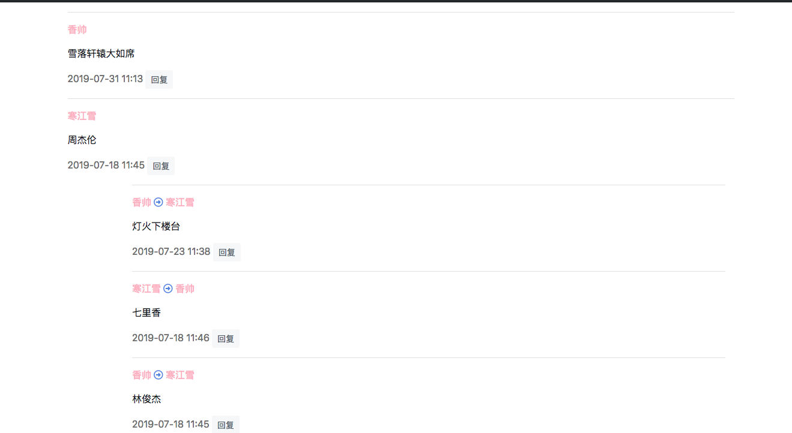

# 20、博客网站搭建二十(锚点定位)

## 锚点是什么
我们写在`html`文件的容器时，经常会用到`id`属性；
	
	<div id='phone'>Apple</div>

这个`id`属性不仅可以作为`JavaScript`或者`css`代码查询某个容器的标记，还可以作为锚点，定位页面应该前往的位置，输入下面地址，就会进入前往打开home页面，并且视窗前往`id=iphone`的容器。
	
	http://www.myblog.com/home#fruit

## 三种实现方式

### HTML拼接

锚点首先要实现功能，就是当管理员点击消息通知时候，浏览器视窗前往此通知评论位置。

因此首先修改文章详情，给渲染评论的`div`容器添加`id`属性，进入`templates/article/detail.html`:

```
...
<!-- 已有代码，遍历树形结构 -->



<!-- 唯一新增代码：id属性 -->
<div class="..." id="comment_elem_{{ comment.id }}" >

    ...

    <!-- 下面都是已有代码 -->
    <div class="children">
        {{ children }}
    </div>
    
</div>



...
```
> 我们还是用`comment.id`来给每条评论赋予唯一的id值，注意`id`属性保持唯一性。前面在二级回复的Modal中用了`comment_{{comment.id}}`,这里千万不要重复了。

然后修改通知列表模板。添加锚点，进入`templates/notice/list.html`:

```
...

<li ...>
    <!-- 新增 comment_elem_{{ notice.action_object.id }} 锚点 -->
    <a href="?article_id={{ notice.target.id }}&notice_id={{ notice.id }}#comment_elem_{{ notice.action_object.id }}"
       target="_blank"
       >
        ...
    </a>
    ...
</li>

...
```
> 注意这里`url`拼接两种：
> 
> * 跟在`?`后面的查询参数，用于给视图传递参数，是之前写的旧代码
> * 跟在`#`后面的是锚点，也就是本章正在学的东西

`?` 和 `#`一个重要的差别就是`?`不能够传递到下面页面的`url`中去，而`#`可以。

用另一个账号登录，发表评论，点击链接查看一下，是够回到对应文章的评论处。



浏览器视窗没有在页面顶部，而是直接前往该条评论处，通过`html`拼接是实现锚点最简单的方法。

## 视图拼接
`html`拼接虽好，单它不是万能的，如果要前往一个当前页面还没有创建的容器，该怎办的呢？

举个栗子，按照目前我们的博客设计，当用户发表评论的时候，页面会刷新，视窗将停留在文章详情的顶部，但是实际上这时候视窗应该停留在新发表评论处才比较合适，因为用户可能想检查一下自己发表的评论是否正确。而在原页面时候由于新评论搜还没发表，所以`Comment.id`是不存在的，没办法用`html`拼接锚点。

这种情况下就需要在视图中拼接锚点了，修改文章评论视图，将锚点拼接到`redirect`函数中，进入`comment/views.py`文件，修改如下：

```
...
# 文章评论视图
def post_comment(request, article_id, parent_comment_id=None):
    ...
    # 已有代码
    if request.method == 'POST':
        ...
        if comment_form.is_valid():
            ...
            if parent_comment_id:
                ...
            new_comment.save()
            if not request.user.is_superuser:
                notify.send(...)

            # 新增代码，添加锚点
            redirect_url = article.get_absolute_url() + '#comment_elem_' + str(new_comment.id)
            # 修改redirect参数
            return redirect(redirect_url)
```
> `get_absolute_url()`是之前章节写的方法，用于查询某篇文章的地址。简单来说就是把拼接的位置从模板挪到了视图中，因为新的评论必须在视图中保存之后才会被分配一个id值。

## 流动的数据

最后我们再看另一种复杂点的情况。当用户发表一级评论的时候，我们再视图中拼接锚点解决了刷新当前页面定位的问题。但是二级评论是通过`iframe + ajax`实现的，这又该如何是好？

理一理思路，首先新的评论`id`值是在视图中创建的，但是由于视图是从`iframe`中请求的，在视图中没办法刷新`iframe`的父页面，所以我们唯一能做的就吧数据传递出去，到前端去处理。

进入`comment/views.py`，修改评论视图：

```
# 引入JsonResponse
from django.http import JsonResponse

...
# 文章评论视图
def post_comment(request, article_id, parent_comment_id=None):
    article = get_object_or_404(ArticlePost, id=article_id)

    # 已有代码
    if request.method == 'POST':
        ...
        if comment_form.is_valid():
            ...
            if parent_comment_id:
                ...

                # 修改此处代码
                # return HttpResponse("200 OK")
                return JsonResponse({"code": "200 OK", "new_comment_id": new_comment.id})

            ...
```
> 引入新的`JsonResponse`返回的是`json`数据格式。有他将新的评论的`id`传递出去。
> 
> `json`是web开发中很常见的轻量级数据格式，非常像python的字典。特别提醒的是json数据格式必须使用双引号。

现在数据在`ifram`中了，但是我们需要刷新的是`ifram`的父页面，使用还需要继续把数据往父页面添加。

修改二级评论模板，进入`templates/comment/reply.html`:

```
...
<script>
...

function confirm_submit(article_id, comment_id){
    ...
    $.ajax({
        ...
        // 成功回调函数
        success: function(e){

            // 旧代码
            // if(e === '200 OK'){
            //     parent.location.reload();
            // };

            // 新代码
            if(e.code === '200 OK'){
                // 调用父页面的函数
                parent.post_reply_and_show_it(e.new_comment_id);
            };
        }
    });
}
</script>
```
> 现在由于ajax获取的json数据，因此用`e.code`获取视图返回的状态。
> 
> 旧代码用`parent.location.reload()`刷新父页面。同样的，用`parent.abc()`可以调用父页面的`abc()`函数。这样就把数据传递到父页面了。

 
这下就好办了呢，在父页面中，（文章详情的模板）需要添加执行锚点拼接的函数，进入`templates/article/detail.html`:

```
...


...
<script>
    ...

    // 新增函数，处理二级回复
    function post_reply_and_show_it(new_comment_id) {
        let next_url = "";
        // 去除 url 尾部 '/' 符号
        next_url = next_url.charAt(next_url.length - 1) == '/' ? next_url.slice(0, -1) : next_url;
        // 刷新并定位到锚点
        window.location.replace(next_url + "#comment_elem_" + new_comment_id);
    };
</script>

``` 

> 函数中运用了JavaScript的[三元运算法则](https://baike.baidu.com/item/%E4%B8%89%E7%9B%AE%E8%BF%90%E7%AE%97%E7%AC%A6).作用是去掉`url`尾部的`/`，否则锚点不会生效，你可能会问，三目运算符多麻烦，为什么不直接把`url`末尾一个字符去除掉的呢？答案是这样写代码更具延展性，万一哪天Django解析的url尾部没有斜杠了呢。
> 
> `window.location.replace()`作用是重定向页面，这里面终于可以愉快的拼接锚点了。

一切都OK了，评论一下，二级评论，顺利的话就正好可以定位到评论的位置了呢。