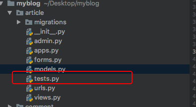

# 22、博客网站搭建二十二(自动化测试)

测试是伴随着开发进行的，开发多久，测试多久，我们一路开发过来都是怎么直接测试，启动服务`runserver`，看看写的页面是够正常。

这样的人工测试有点是非常直观的，你看到的和用户看到的完全是相同的，但是确定也是很明显的：

* 效率低。在开发的时候你可能需要反复修改代码，测试功能，这样重复查看几十次甚至几百次网页会让人崩溃的。
* 容易遗漏BUG。伴随你项目越来越复杂，组件之间的交互更加复杂。修改某一组件的时候，可能会影响到其他地方，有些你是暂时发现不了的，有些影响范围比较广，你只是测试当前修改的部分，所以会遗漏。
* 有的测试不方便进行。如果有的功能，限制每个用户每天发表评论不能超过10条评论，人工测试就显得比较麻烦，特别是需要反复测试的时候。

为了解决人工测试的各种问题，`Django`引入了`Python`标准库的单元测试。也就是自动化测试：你可以写一段代码，让代码帮你测试！代码会忠实完成测试任务，帮助你从繁重的测试工作中解脱出来。除此之外，自动测试化还有以下优点：

* 预防错误。当应用过于复杂的时候，代码的意图变得非常不清晰，甚至你都看不懂自己写的代码，这是很常见的，而测试好像就是从内部审查代码一样，可以帮助你发现微小错误。
* 有利于团队合作。 良好的测试保证其他人不会不小心破坏你的代码，现在已经不是单打独斗的年代了，想要成为优秀的程序员，你必须擅长写测试代码。

虽然学习自动化不会让你的博客网站增加一丝功能，但是可以让你代码更加强壮。

[Django官网文档的第5部分](https://docs.djangoproject.com/zh-hans/2.2/intro/tutorial05/)讲的非常清晰，并且有中文版，推荐直接去读官网。

## 第一个测试
为了演示测试是如何工作的，让我们首先在文章模型中写个有BUG的方法，进入`article/models.py`:

```
class ArticlePost(models.Model):
    ...

    def was_created_recently(self):
        # 若文章是"最近"发表的，则返回 True
        diff = timezone.now() - self.created
        if diff.days <= 0 and diff.seconds < 60:
            return True
        else:
            return False
```
> 这个方法用于检测当前文章是否最近发表的。
> 
> 这个方法稍微扩展一下会变的非常实用。比如可以将博文的发表日期改为'刚刚'，‘3分钟前’，‘1小时前’等相对应的时间，用户体检将有提升。

仔细看看，它是没有办法正确判断‘未来’，输入`python manage.py shell`文章的进入shell：

```
>>> import datetime
>>> from django.utils import timezone
>>> from article.models import ArticlePost
>>> from django.contrib.auth.models import User

# 创建一篇"未来"的文章
>>> future_article = ArticlePost(author=User(username='user'), title='test',body='test', created=timezone.now() + datetime.timedelta(days=30))

# 是否是“最近”发表的？
>>> future_article.was_created_recently()
True
```
未来发生的肯定不是最近发生的，因此代码是错误的。

## 写个测试暴露BUG
接下来就要写测试用例，将测试转化为自动化。

如下图的目录：



其中这个`test.py`就是留给你写测试用例的地方，进入`articel/tests.py`:

```
from django.test import TestCase
import datetime
from django.utils import timezone
from article.models import ArticlePost
from django.contrib.auth.models import User


class ArticlePostModelTests(TestCase):
    def test_was_created_recently_with_future_articel(self):
        # 如果文章创建时间为未来，则返回FALSE
        author = User(username='user', password='test_password')
        author.save()

        future_article = ArticlePost(
            author=author,
            title='test',
            body='test',
            created_time=timezone.now() + datetime.timedelta(days=30)
        )

        self.assertIs(future_article.was_created_recently(),False)

```

> 基本就是把刚才在`shell`中的测试代码抄了过来，有点不同的是这个`asserIs`方法，了解**断言**的同学应该很熟悉它：它的作用就是检测方法内的两个参数是否完全一致，如果不是则抛出异常，提醒你这个地方是有问题的。

接下来运行测试：

	(env) AdministratordeiMac:myblog administrator$ python manage.py test
	
运行结果如下：

```
Creating test database for alias 'default'...
System check identified no issues (0 silenced).
F
======================================================================
FAIL: test_was_created_recently_with_future_articel (article.tests.ArticlePostModelTests)
----------------------------------------------------------------------
Traceback (most recent call last):
  File "/Users/administrator/Desktop/myblog/article/tests.py", line 21, in test_was_created_recently_with_future_articel
    self.assertIs(future_article.was_created_recently(),False)
AssertionError: True is not False

----------------------------------------------------------------------
Ran 1 test in 0.002s

FAILED (failures=1)
Destroying test database for alias 'default'...
```
> 这里是有很多名堂的：
> 
> * 首先测试系统会在所有以test开头的文件中寻找测试代码
> * 所有`TestCase`的子类都被认为是测试代码
> * 系统创建了一个特殊的数据库功测试使用，即所有测试产生的数据不会对你自己的数据库造成影响
> * 类中所有以`test`开头的方法都会被认为是测试用例
> * 在运行测试用例的时候，`assertIs`抛出异常，因为`True is not False`
> * 完成测试后，自动销毁测试数据库

测试系统明确指明了错误的数量、位置和种类等信息。