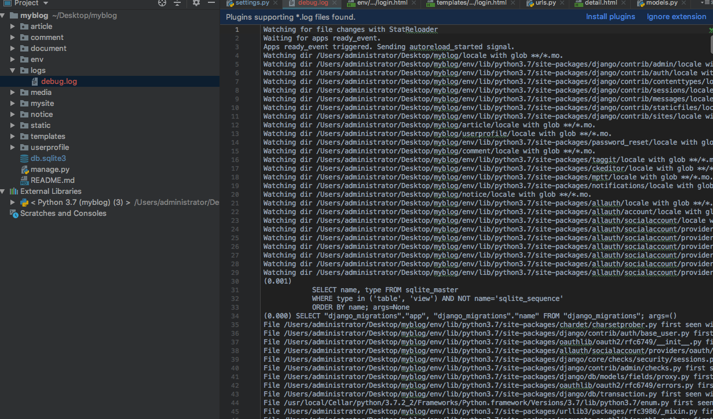
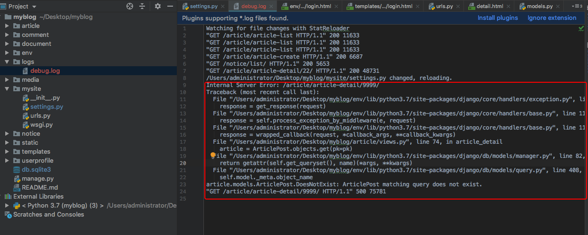

23、博客网站搭建二十三(日志记录)

一旦上线，开发者是如何得知用户到底是哪里出了问题呢？用户大部分与你素昧平生。分布在不同的地方，一旦`DEBUG = False`,出错时候并不会出现报错页面，联用户自己也不清楚哪里出了BUG。日志将会是你最后的倔强。

## 日志的组成
日志是是指程序运行过程中，对状态、时间、错误等的记录。即把运行过程中产生的信息输出或者保存起来，供开发者查询。

DJango使用Python内置的`logging`模块处理日志。关于该模块的使用，[Python文档](https://docs.python.org/3/howto/logging.html)里面有详细的讨论.如果你从未使用，这里是一个很简单的入门。

日志时间信息流程如下：


> 看不懂，没关系。以后你需要深度使用日志时候，回来仔细研究就可以了。
> 
> 这份日志配置由`Loggers`,`Handlers`, `Filters`, `Formatters`四部分组成。

## Loggers
`loggers`即记录器，是日志系统的入口。它有三个重要的工作：

* 向应用程序（也就是你的项目）公开几种方法，以便运行时记录消息。
* 根据传递给Logger的消息的严重性，确定出需要处理的消息。
* 将需要处理的消息传递给给所有感兴趣的处理器(Handler)。

每一条写入logger的消息都是一条日志记录。每一条日志记录也包含级别，代表对应消息的严重程度。常用的级别如下：

* `DEBUG`:排查故障时候，使用的地基被系统信息，通常开发时候使用。
* `INFO`: 一般的系统信息，并不算问题
* `WARNING`: 描述系统发生的小问题的信息，但通常不影响功能
* `ERROR`: 描述系统发生的重大问题信息，可能导致功能不正常
* `CRITICAL`: 描述系统发生严重问题的信息，应用程序有崩溃风险

当logger处理一条消息时候，会将自己的日志级别和这条消息的日志级别作对比。如果消息的级别匹配或者高于logger的日志级别，他就会别进一步处理，否则这条消息就会被会略掉。

当logger确定了一条消息需要处理之后，会把它传给`Handler`。

## Handlers

`Handler`即处理器，它的主要功能是决定如何入力logger中的每一条消息，比如把消息输出到屏幕，文件或者email中。

和Logger一样，handler也是有级别概念，如果一条日志记录的级别不匹配或者低于handler的日志级别，则会被handler忽略。

一个logger可以有多个handler，每一个handler可以有不同的日志级别。这样就可以根据消息的重要性不同，来提供不同的类型输出。例如，你可以添加一个handler吧`ERROR`和`CRITICAL`消息发送到你的Email，再添加另一个handler把所有的消息（包括`ERROR`和`CRITICAL`消息）保存到文件里。

## Filters

`Filter`即过滤器。在日志记录从logger传到handler的过程中，使用`Filter`来做额外的控制。例如只允许某个特定来源的`ERROR`消息输出。

`Filter`还被用来在日志输出之前对日志记录做修改。例如当满足一定条件时候，把日志记录从`ERROR`降到`WARNING`。

Filter在logger和handler中都可以添加，多个filter可以链接起来使用，来做多重过滤操作。

## Formatters
`Formatters`即格式化器，主要功能是确定最终输出的形式和内容。

## 日志配置实例
简单的示例，在Django中可以通过字典的形式对整个项目的日志进行配置，配置的位置当然是在`settings.py`中了，一个简单的配置如下，进入`mysite/settings.py`:

```
LOGGING = {
    'version': 1,
    'disable_existing_loggers': False,
    'handlers': {
        'file': {
            'level': 'DEBUG',
            'class': 'logging.FileHandler',
            'filename': os.path.join(BASE_DIR, 'logs/debug.log'),
        },
    },
    'loggers': {
        'django': {
            'handlers': ['file'],
            'level': 'DEBUG',
            'propagate': True,
        },
    },
}
```
> 字典中的`version`指明了配置的版本，`disable_existing_loggers`指明是否禁止默认配置的记录器。这两项通常不需要去改动，重点看下`loggers`和`handlers`的配置。
> 
> * 如前面所说，一条消息首先传递给logger。Django中内置了集中记录器，比如这里用到的`Django`记录器，他会接收Django层次中的所有消息。然后我们定义了需要处理`DEBUG`以上级别的消息，并把这些消息传递给叫`file`的处理器。`‘propagate’: True`意思是本记录器处理过的消息其他处理可以继续处理。
> * 现在消息来到名叫`file`的`handlers`中了。这个处理器定义了消息处理界别仍然为DEBUG，在class中定义将消息输入到文件中去，文件地址为项目目录`logs/debug.log`.
> * 因为这里没有配置`filters`和`formatters`,因此会采用默认的设置。

需要注意的是日志的输出文件的目录`log/`一定要提前创建好，确保项目拥有此目录的写入权限。

这个日志系统就配置好了，接下来运行项目，随便刷新几个页面看看`debug.log`中有没有写入消息。

随便数显几个页面进入log/debug.log就会看到如下荣昌的数据:



>`debug.log`文件中出现了一大堆冗长的信息，因为`DEBUG`级别会包含所有数据库查询的信息。
>
>默认情况下，仅在调试模式下才会显示`DEBUG`级别的消息日志，部署在线上时候只会将`INFO`或者以上的信息进行记录。


再试试别的，把上面的代码中记录和处理的日志都改为`INFO`.


下面我们改成`ERROR`信息看看会输出什么，在地址栏输入一个不存在文章详情的地址，看看会得到什么:



> `ERROR`输出了整个BUG的回溯，和你在浏览器中的报错是完全一样的，这些信息就非常有用，基本上`ERROR`信息都能够暴力出用户使用你的网站过程中的大部分问题；也就是说每一个`ERROR`都是需要你去解决掉的。`ERROR`信息的错误码通常都是`500`，也就是服务器内部错误的代码。

不过仔细想想，很多时候并不是BUG，而是用户输入url时候自己犯了一个错误。所以我们把文章详情视图的`Article.objects.get(pk=pk)`改成`get_object_or_404(ArticlePost, pk=pk)`试试。进入`article/views.py`：

```
from django.shortcuts import get_object_or_404

def article_detail(request, id):
    # 取出相应的文章
    # article = ArticlePost.objects.get(id=id)
    article = get_object_or_404(ArticlePost, id=id)

    ...
```
重启服务器，再次刷线一个不存在的页面，看看日志：

```
Not Found: /article/article-detail/9999/
"GET /article/article-detail/9999/ HTTP/1.1" 404 1780
```
> 现在他已经不是一条`ERROR`信息了，而是变为了`WARNING`,所以也没有了错误回溯（错误代码也有500变成了400）。这里就看出这两个方法的重要区别了；在项目中具体选择哪个没定论，还是以你的具体需求设定。

## 复杂示例
接下用看一个复杂的示例

```
LOGGING = {
    'version': 1,
    'disable_existing_loggers': False,
    'formatters': {
        'verbose': {
            'format': '{levelname} {asctime} {module} {process:d} {thread:d} {message}',
            'style': '{',
        },
        'simple': {
            'format': '{levelname} {message}',
            'style': '{',
        },
    },
    'filters': {
        'require_debug_true': {
            '()': 'django.utils.log.RequireDebugTrue',
        },
        
    },
    'handlers': {
        'console': {
            'level': 'INFO',
            'filters': ['require_debug_true'],
            'class': 'logging.StreamHandler',
            'formatter': 'simple'
        },
        'mail_admins': {
            'level': 'ERROR',
            'class': 'django.utils.log.AdminEmailHandler',
            'formatter': 'verbose',
        },
        'file': {
            'level': 'WARNING',
            'class': 'logging.FileHandler',
            'filename': os.path.join(BASE_DIR, 'logs/debug.log'),
            'formatter': 'verbose',
        },
    },
    'loggers': {
        'django': {
            'handlers': ['console'],
            'propagate': True,
        },
        'django.request': {
            'handlers': ['file', 'mail_admins'],
            'level': 'WARNING',
            'propagate': False,
        },
    }
}
```
分析一下次配置：
> 配置中定义了两个格式化器：
> 
> * `verbose`: 详细的格式化器，依次输出：消息级别、发生时间、抛出模块、进程ID、线程ID、提示信息
> * `simple`: 简要格式化器，仅输出消息级别和提示信息
> 
> 一个过来器：
> 
> * `require_debug_true`:使用此过滤器的消息仅在调试时才会生效
> 
> 三个处理器：
> 
> * `console`: 处理`INFO`以上级别的消息，输出简要信息的命令中，此处理器仅在调试模式生效
> * `mail_admins`: 处理`ERROR`以上级别消息，输出详细信息到Email中
> * `file`:处理`WARMING`以上级别消息，输出详细信息到文件中
> 
> 两个记录器：
> 
> * `django`：将`django`产生的所有消息转交给`console`处理器
> * `django.request`：将网络请求相关信息转交给`file, mail_admins`这两个处理器。注意这里`'propaggate':False`使得记录器处理过程的消息不再让`django`记录器再次处理了。

我们可以尝试制造不容级别的消息，看看日志系统是否正常工作。当然最重要的，跟Email有关的配置一定要实现把Email给配置好，

```
# SMTP服务器
EMAIL_HOST = 'your smtp'
# 邮箱名
EMAIL_HOST_USER = 'your email'
# 邮箱密码
EMAIL_HOST_PASSWORD = 'your password'
# 发送邮件的端口
EMAIL_PORT = 25
# 是否使用 TLS
EMAIL_USE_TLS = True
# 默认的发件人
DEFAULT_FROM_EMAIL = 'your email'
```

## 日志分隔
现在我们可以愉快的进行日志记录了，接下来一个问题是如何分隔日志？假设你的网站能够有幸运行很久，如果不间断的往同一个文件夹中写日志，他最终会变成一个拖垮服务器的庞然大物。

最好是日志能够安好走啊自然天进行记录和分隔，好在这个问题也不需要你自己费神去解决，Python帮你搞定了。

进入`myblog/mysite/setting.py`,把处理器稍微修改一下：

```
...
LOGGING = {
    ...
    'handlers': {
        ...
        'file': {
            ...
            # 注释掉 class
            # 'class': 'logging.FileHandler',

            #新增内容
            'class': 'logging.handlers.TimedRotatingFileHandler',
            'when': 'midnight',
            'backupCount': 30,

        },
    },
    ...
}
```
> * `TimeRotatingFileHandler`:Python内置的随时间分隔日志文件的模块。
> * `when`：分隔时间为凌晨
> * `backupCount`:日志文件保存日期为30天

接下来把系统时间往后调一天，然后重新启动服务器。

	(env) AdministratordeiMac:myblog administrator$ python manage.py runserver  --noreload

注意这次启动和以前有点不一样，后面有个`--noreload`后缀。这是因为通常Django的调试服务器运行时顺带启动重载器，所以没放重载器检查到代码有变化后，会自动重启服务器，相当方便。但是问题是分隔文件与重载器同时操作日志文件会产生冲突，因此这里一定要用`--noreload`暂时将重载器禁止掉。

然后刷几条消息，你会发现老的日志已经更名为debug.log.2019-X-X了，而刚刚刷新的消息，则保存在`debug.log`中。

除了上面说到的`TimedRotatingFileHandler`,Python还提供了一个按照文件大小分割的`RotatingFileHandler`.还可以在[Pyhton官方文档](https://docs.python.org/3/library/logging.handlers.html#logging.handlers.RotatingFileHandler)中查看。

## 自定义日志

内置配置功能已经基本满足90%以上的需求了，但是总有些时候你想在一些奇怪的地方进行记录，这就需要你自己在代码中插入自定义的日子代码了。

自定义日志用起来也是相当方便的：

```
from mysite.settings import LOGGING
import logging

logging.config.dictConfig(LOGGING)
logger = logging.getLogger('diango.request')

def whatever(request):
	# do something
	logger.warning('Something went wrong')
	# do something else
```
导入刚才写的日志框架并将`django.request`配置到`logger`对象中。然后你就可以在任何地方安插任何级别的消息了，消息内容可以用字符串格式化的方法（str.format()）,玩出各种花样。

想深入了解可以看[Django logging](https://docs.djangoproject.com/en/2.2/topics/logging/) 和 [Python3 logging](https://docs.python.org/3/library/logging.html)。
