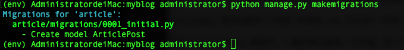
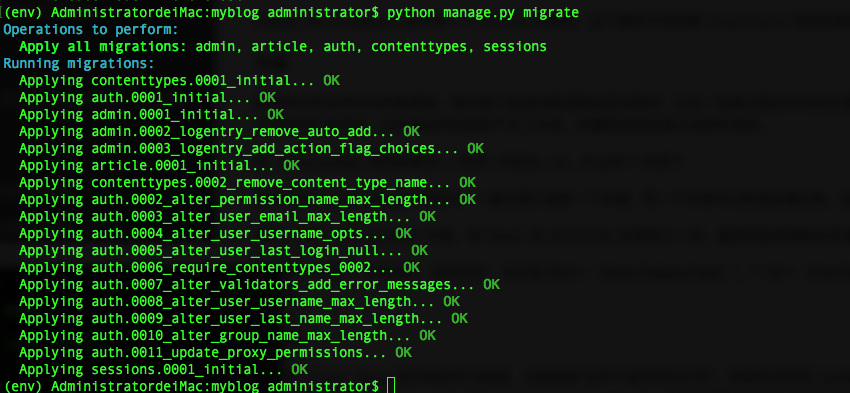

# 博客网站搭建2(数据库和模型)

## 编写文章的model模型
Django框架只要关注的是模型(model),模板(Template),视图(Views),称之为MTV模式。
各自的职责如下：

层次                     |     职责 
------------------------|-----------------------------------------------------------------
模型（model），即数据存取层 | 处理与数据相关的所有业务：如何存取、如何验证有效性、包含哪些行为以及数据之间的关系等
模板（Template），即业务逻辑层 | 处理与表现层相关的决定： 如何在页面或者其他类型文档中进行显示
视图（Views），即表现层 | 存取模型及调取恰当模板的相关逻辑。模型与模板之间的桥梁。

**换成人话就是：Model存取数据，View决定需要调取那些数据，而Templates则负责将调取出来的数据以合理的方式展现出来。**
 
## 数据库与模型
数据库是存储电子文件的场所，存储独立的数据集合。**一个数据库**由多个**数据表**构成。

WTF?比如你们公司的技术部门员工册就是一个数据表。有的员工册记录每个员工的工资，五险一金等，所有这些部门员工册子都在公司总部财务那里，财务那里就是**数据库**了。
> 默认情况数据库就是db.sqlite3这个文件了，以后上线以后你可能想换成别的数据库，不过这个还是以后再说。

操作数据库使用的是赋值的SQL语句（就是那个一写一大串的SQL语句），他是不同于Python的另外一种语言，我们要操作这个吗。
对于新手来说，这无疑是灾难性的事件。还好Django里写web应用并不需要你直接去操作数据库，而是只需要定义好**模型（Python语法就可以）**,**模型**中包含了操作数据库所必要的命令。

也就是说你只要定义好数据模型，其他的底层代码都不用care，他们会自动从模型生成。

> 这个有一个专门的术语，叫**对象关系映射（Object Relational Mapping，简称ORM）**，由于实现面向对象编程语言里，不同类型系统的数据之间的转换。

## 编写Model
如前面所说，Django中通过（Model）映射到数据库，处理与数据相关的事务。

对于博客网站来说，最重要的就是你的文章。所以首先来建立一个存放文章的数据模型：

打开`article/models.py`文件，写入代码：

```
from django.db import models

# 导入内置的User模型
from django.contrib.auth.models import User

# timezone 用于处理时间相关的事务
from django.utils import timezone


# 博客文章数据模型
class ArticlePost(models.Model):

    # 文章作者。参数。 on_delete用于指定数据删除的方式，2.0以后这个参数必须添加
    author = models.ForeignKey(User, on_delete=models.CASCADE, verbose_name='文章')

    # 文章标题。 model.CharField 为字符串字段，用于保存较短的字符串，比如标题.max_length指定字符最大长度
    title = models.CharField(max_length=100, verbose_name='标题')

    # 文章正文，保存大量文本使用TextField
    body = models.TextField(verbose_name='正文')

    # 文章的创建时间。参数default=timezone.now指定其在创建数据时候将默认写入当前的时间
    created_time = models.DateTimeField(default=timezone.now, verbose_name='创建时间')

    # 文章的更新时间。参数 auto_now=True，指定每次数据跟新是自动写入当前的时间
    update_time = models.DateTimeField(auto_now=True, verbose_name='更新时间')

    # 函数 __str__定义当调用对象的str()方法的时候的返回值内容，这里后台管理系统的可以看到标题，不写这个看到的会是字段
    def __str__(self):
        return self.title

    # 内部class Meta用于给model定义元数据
    class Meta:

        # ordering 指定模型返回的数据的排列顺序
        # '-created_time'表明数据已改以倒序排列
        ordering = ('-created_time',)  # 注意这里是元组（Tuple）
        verbose_name = "文章"
        verbose_name_plural = '文章'
    
```

> * 每个模型都别表示为`django.db.models.Model`类的子类，从他继承了操作数据库的所有方法。
> * 每个字段都是`Field`类的实例。比如字段被表示为`CharField`，日期时间字段被表示为`DateTimeField`.这将告诉Django要处理的数据类型。
> * 定义`Field`类实例需要参数。例如`CharField`需要一个`max——length`参数，这个参数的用处不止用来定义数据库结构，也用于验证数据。
> 使用`ForeignKey`定义一个关系。这将告诉Django一个（或者多个）`ArticlePost`对象都关联到**一个`User`对象。**（Django有一个内置的账号管理系统，一般网站的用户相关的的基本功能是都满足的）。
> * 内部类Meta中的`ordering`定义了数据的排列方式。`-created`表示将以创建时间的倒序排列，保证了最新的文章总是在网页的最上方。注意`ordering`是元组，括号中只含一个元素时不要忘记末尾的**逗号。**
> * ` __str__`方法定义了需要表示数据时应该显示的名称。给模型增加 __str__方法是很重要的，它最常见的就是在Django管理后台中做为对象的显示值。因此应该总是返回一个友好易读的字符串。
> 
> * 字段`verbose_name`这里表示字段的中文显示意思，后面我们到后台管理系统的时候，这里会有直观的表现，如果这里没有写代表的中文意义，后台管理系统会直接显示字段名。

## 知识点讲解

#### 导入

Django框架是基于python语言，而在python中用`import`或者`from...import`来导入模块。

模块其实就是一些函数和类的集合文件，他能实现一些相应的功能。当我们需要使用这些功能的时候，直接把相应的模块导入到们的程序中就可以使用了。

`import`用于导入整个模块功能，但是实际使用中往往只需要用模块中的某一个功能，为此导入整个模块就没必要，而且显得会臃肿。因此可以用`from a import b`表示从模块a中导入b给我只用就够了。

#### 类

Python作为面向对象编程语言，最重要的概念就是**类(class)**和**实例(instance)**。

类是抽象的模板，而实例是根据这个类创建出来的一个个具体的"对象".每个对象都拥有相同的方法，但各自的数据可能不同，而这些方法被打包封装在一起就成了**类**。

比如我们刚刚写的`ArticlePost`类，作用就是为这个博客文章的内容提供一个模板，每当有一篇新文章生成的时候，都要对比`ArticlePost`类来创建`auth`,`title`，`body`...等数据；虽然每篇文章的具体内容可能不一样，但是都必须准守相同的规则。

在Django中，数据由模型来处理，而模型的载体就**类（class）**.

#### 字段

字段（field）表示数据库的一个抽象类，Django使用字段类创建数据库表，并将python类型映射到数据库。

在模型中，字段被实例化类属性表示特定的表，同时具有将字段映射到数据库的属性以及方法。

比如说`ArticlePost`类中有一个`title`的属性，这个属性中保存着`Charfield`类型的数据，即一个较短的字符串。


#### 外键

数据库中有各种各样的数据表，有时候几张表的数据是相互关联的，比如一张表记录的所有的文章，另一张表记录的所有的用户，而文章是用户发表的，这时候这两张表就产生了关系。**外键**就是用来表示这种关系的。

而`ForeignKey`是用来解决`一对多`关系的。so，什么叫“一对多”？

在我们的`ArticlePost`模型中，一篇文章只能有一个作者，而一个作者可以有很多篇文章，这就是'一对多'的关系。

因此，通过`ForeignKey`外键，将`User`和`Article`关联到了一起，最终就是将博客的作者和完整的用户关联在一起了。

既然有“一对多”，太极两仪，阴阳相对，肯定有“多对一（ManyToManyField）”，“一对一（OneToOneField）”。以后我们用到了再慢慢了解。


#### 内部类

内部类`class Meta`提供模型的元数据，元数据是“任何不是字段的东西”，例如排序选项`ordering`,数据库表名`db_table`，单数和复数名称`verbose_name`和`verbose_name_plural`.这些信息不是某篇文章的私有的数据，而是整张表的共同行为。

要你不要写内部类是可选的，当然有了它可以帮助我们理解并规范类的行为。

在`ArticlePost`中我们使用的元数据`ordering=('-created_time',)`,表名没放我们需要取出文章列表，作为博客首页的时候，按照`-created_time`(即文章的创建时间，负号表示倒序)来排列，保证了最新文章永远在最顶部位置。

## 数据迁移

编写好model之后，接下里就是需要进行数据迁移。迁移是Django对模型所做的更改传递到数据库中的方式。

**attention：每当对数据库进行了修改（CRUD） 操作，都需要进行数据可迁移**。

Django的迁移代码是有模型文件自动生成的额，它本质上只是个历史记录，Django可以用它来进行数据库的滚动更新，通过这种方式时期能够和当前的模型进行匹配。

在我们上面建立的的虚拟环境中，进入myblog文件夹，输入`python manage.py makemigrations`,对模型的更改创建新的迁移表：



通过运行`makemigrations`命令，Django会检查到你对模型文件的修改，并且把修改的部分存储为一次迁移。

然后输入`python manage.py migrate`，应用迁移到数据库中：



> `migrate`命令迁移所有执行过的迁移应用到数据库上，也就是将模型的更改，同步到数据库结构上。迁移是非常强大的功能，他能让
> 你在开发过程中持续的改变数据库的结构而不需要重新删除和创建表。它专注于数据库的平滑升级而不会丢失数据。
> 
> 记得每次当你修改了`models.py`文件的时候，都要进行`makemigrations`和`migrate`。


