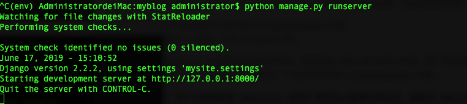
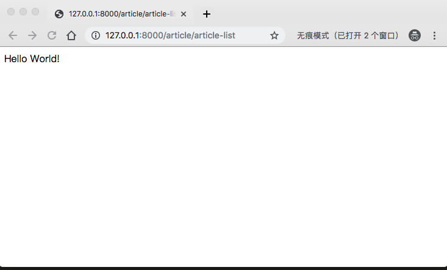
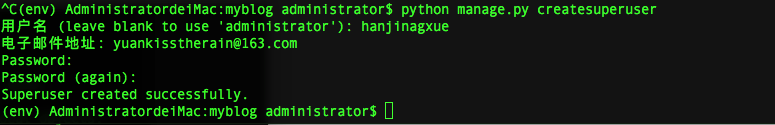
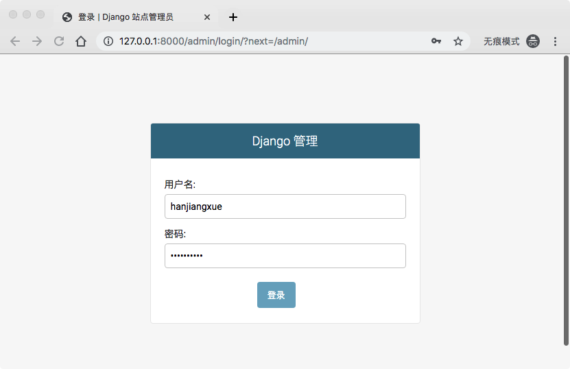
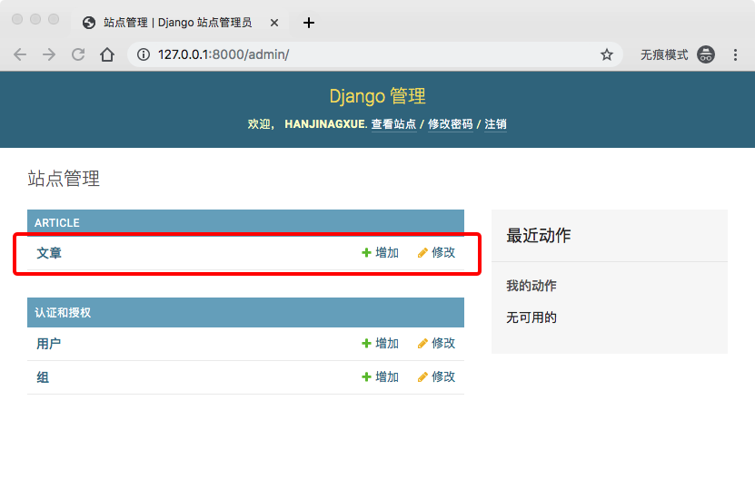
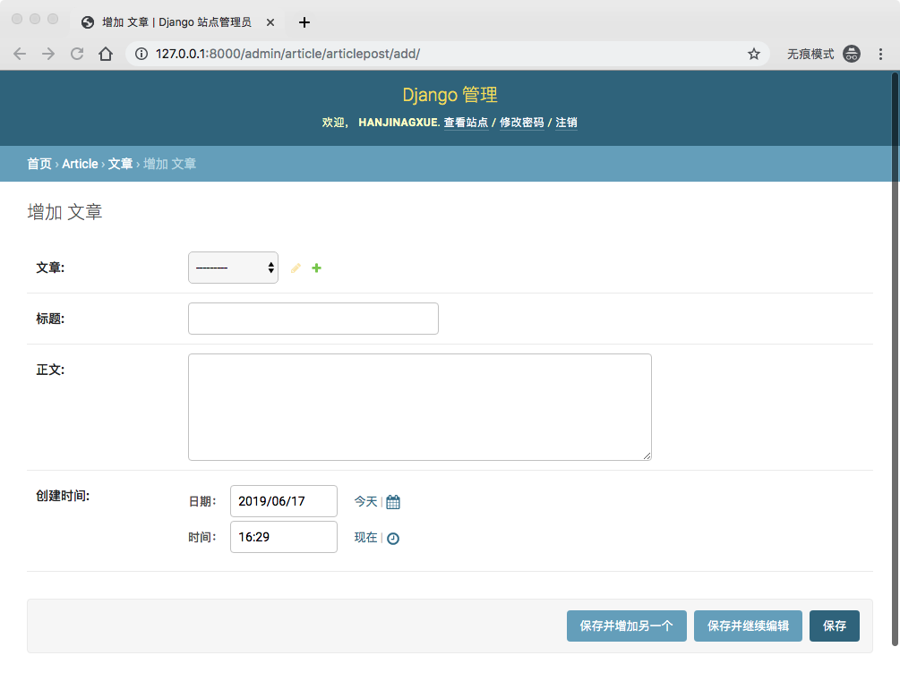
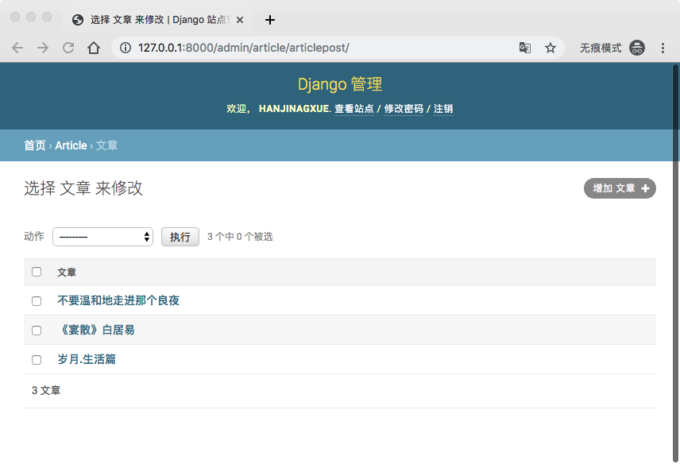
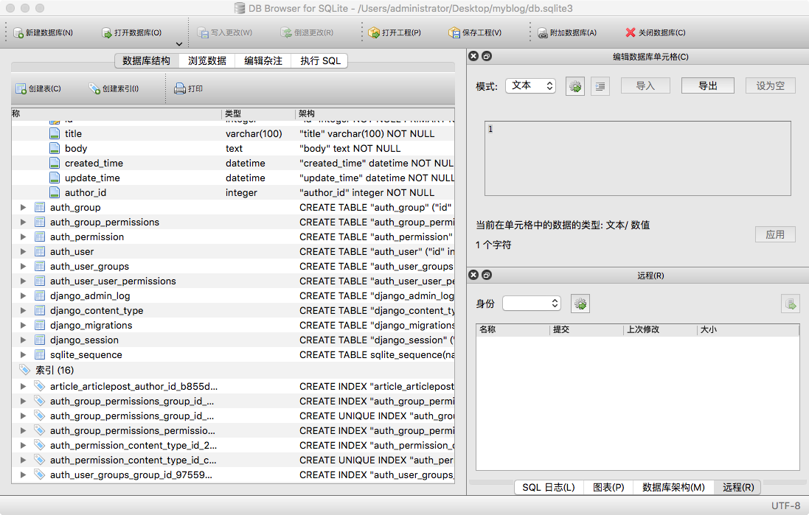

3、博客网站搭建三(视图和后台管理系统)

数据库已经有了，参考上一节，但是用户通常只需要这个庞大数据库的一小部分CRUD。为此还需要代码贷取出并展示数据，这一部分就被称为**视图**。

Django中视图的概念，**一类具有相同功能和模板的网页的集合**。比如在一个博客中，你可能会创建如下几个视图：

* 博客首页：展示最近的几项内容
* 文章详情：详细展示一些功能
* 评论处理器：为响应添加一些评论的操作

这些都需要视图（View）去处理。

## Hello world
老规矩，任何语言的第一个输出都是Hello World！。首先在浏览器中先打印出这个字符串：

打开`article/views.py`文件:

```
# 导入HTTPResponse模块
from django.http import HttpResponse

def article_list(request):
    return HttpResponse('Hello World!')

```

> 网页都是有视图派生而来的，每一个视图表现为一个简单的Python函数，他必须做两件事：
> 
> * 返回一个包含请求页面内容的`HttpResponse`对象
> * 或者抛出一个异常，比如`Http404`等。
> 
> 视图中的`request`与网页发来的请求有关，里面包含`GET`或`POST`内容、用户浏览器、系统信息等。Django调用`article_list`函数时候，会返回一个包含字符串的`HttpResponse`对象。

 有了视图之后，我们还需要配置`URLconfs`,将用户请求的url链接关联起来。或者说`URLconfs`的作用就是讲URL映射到视图中。
 
 在上一篇文章中，我们添加多urls.py文件，现在进入`article/urls.py`文件，修改代码如下：
 
 
```
# 引入path
from django.urls import path

# 引入views.py
from . import views


# 正在部署的APP名称

app_name = 'article'

urlpatterns = [

    # path函数将url映射到视图
    path('article-list', views.article_list, name = 'article_list'),
]
```
> Django会根据用户请求的url来选择哪个视图，这里用户请求`article/articel-list`链接时，会调用`views.py`中的`articel_list`函数，并返回渲染后的对象。
> 
>参数`name`用于反差url地址，相当与给url起了一个名字，后面会用到的，我们再细说。

在虚拟环境中,进入**myblog**文件夹下，启动服务`python manage.py runserver`（后面说启动服务，默认就是在这个流程下启动服务）.


 
运行成功，打开浏览器，输入地址`http://127.0.0.1:8000/article/article-list/`.

> 其中`http://127.0.0.1:8000/`是Django提供的本地调试服务器地址。
> 
> `article`是项目路由`myblog/urls.py`里面分发的地址（第一篇有提到这个原因）。
> 
> `article-list`是刚才配置的,在`article/urls.py`文件中。

然后如果你没有搬错砖，你应该会看到如下图显示：


 

## 准备工作

上面是小试牛刀，现在真正开始做一些展示视图前的准备工作。在上篇数据库和模型中最燃定义了数据库表，但是这个表是空的，不方便我们展示视图，所以写view之前，我们需要添加一些数据。

#### 网站后台

网站后台，有时也称为网站管理后台，是用于管理网站的一系列操作（CRUD）。Django内置了一个很好的后台管理系统，只要少量的代码就可以实现强大的功能。

#### 创建超级管理员账号

管理员账号（Superuser）是可以进入后台网站，对数据进行维护的账号，具有最高的权限。我们这里添加一个管理员账号，一遍后面添加数据。

在虚拟环境中输入：`python manage.py createsuperuser`指令，创建管理员账号：



输入指令后按照提示填写就可以了，要记住后面会用到这个账号密码。

#### 将ArticlePost注册到后台中

接下来，我们需要告诉Django，后台中需要添加`AriticlePost`这个数据表提供管理。

打开article/admin.py ，写入一下代码：

```
from django.contrib import admin

# 导入ArticlePost
from .models import ArticlePost


# 注册ArticlePost到admin中
admin.site.register(ArticlePost)
```

## 后台管理系统

启动服务，进入`http://127.0.0.1:8000/admin/`,可以看到一下界面：



用刚才创建的管理员账号进去就可以看到下面界面(还记得上篇模型里添加的一个字段verbose_name吗，如果那里没添加这里不是显示文章，而是ArticlePost，下面详情中也会是一些字段名，你可以试一下去掉这个字段刷新一下看看效果)：




点击文章这个分组，进入，会看到如下：


因为我们没添加任何内容，所以之类是空的，点击右上角的增加文章：



然后在这里添加一些文章，标题等，直接点击保存。


然后里面会有一些删除，添加，修改操作，可以自己玩一下。

## 查看数据库

通过上面的操作，我们的数据库已经有了一条用户数据，3条文章数据了。有时候我们需要检查一下数据库查看数据是否正确，但是项目中的数据库文件`db.sqlite3`又无法直接打开，这时候就需要用到专门处理SQLite数据的文件软件了。一般轻型免费的[SQLiteSudio](https://sqlitestudio.pl/index.rvt)，[DB Browser for SQLite](https://sqlitebrowser.org/),下载并安装，我使用的是DB Browser for SQLite。打开`db.sqlite3`,软件导航左边可以看到如下的数据列表了,点击不容的导航可以查看不同的数据：
