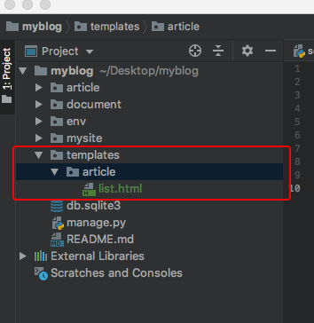
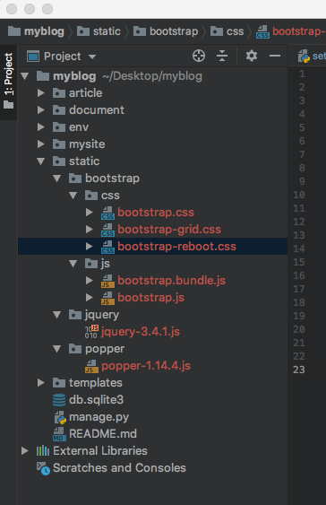
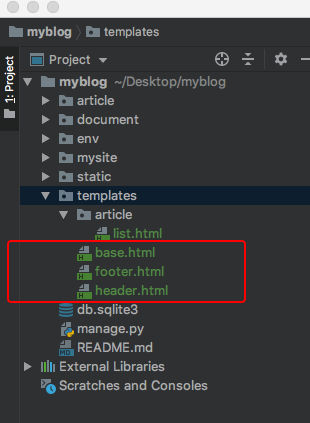
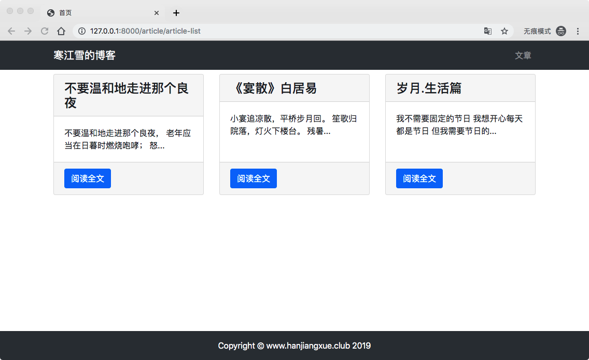

# 4、博客网站搭建四(视图、模板)


## 4.1 视图修改

上一篇我们只是对视图做了初步的窥视，视图的真正作用没有发挥出来，现在我们改写`article/views.py`中的`article_list`函数：

```
from django.shortcuts import render
from .models import ArticlePost


def article_list(request):
    
    # 取出所有的博客文章
    articles = ArticlePost.objects.all()
    # 需要传递给模板（templates）的对象
    context = {'articles': articles}
    # render函数，载入模板并返回context对象
    return render(request, 'article/list.html', context)

```
> *  `from .models import ArticlePost`从`modes.py`文件导入`ArticlePost`数据类。
> *  `ArticlePost.objects.all()`是数据类的方法，可以所得所有对象（这里既是博客文章）,并传递给`articles`变量.
> *  `context `定义了需要传递给模板的上下文，这里即是`articles`。（模板是什么东东下面会说）。
> *  `render`函数，他的作用是结合上下文和模板，并返回渲染后的`HTTPResponse`对象，也就是把context的内容，加载进模板，并通过浏览器呈现。
> 	* `render`中`request`是固定的`request`对象，写就对了
> 	* `article/list.html`定义了模板文件的位置、名称
> 	* `context`定义了需要传入模板的上下文
> 
> 基本视图就这样搞定了

## 模板编写

上面我们定义了模板位置在`article/list.html`，因此在根目录下新建templates文件夹，在templates文件夹下新建article文件夹，然后再article文件夹中新建`list.html`文件，结构是这样的：



>另外新建article文件夹的目的是为了结构明确，以后你还有有很多app，不可能全部都放在templates文件夹下，这样一是会混乱不便管理，另外后面我们寻址路由也会不明确，后面我们用到这里你就会明白了。

上面有一个`.html`的文件，这个是干什么用的呢。它呢，HTML是一种用于创建网页的标记语言。它被用来结构化信息，标注哪些文字是标题、哪些文字是正文等（当然不仅仅这点功能）。也可以简单理解为“给数据排版”的文件，跟你写文档用的Office Word一样一样的 。这里呢，我假装你已经知道了什么HTML了。

在`list.html`文件中，写入一下内容：

```
<!DOCTYPE html>
<html lang="en">
<head>
    <meta charset="UTF-8">

<title></title>

</head>
<body>
    
        <P>{{ article.title }}</P>
    

</body>
</html>
```
> Django通过模板来动态生成HTML，其中就包含描述动态内容的一些特殊语法：
> 
> * `: articles`为函数视图的`context`上下文，即所以的文章集合。``循环表示依次取出`articles`中的元素，命名为`article`，并分别执行接下来的操作。末尾用``告诉Django循环结束的位置。
> 
> * 使用`.`语法来访问变量属性。这里的article为模型中的某一条文章，在前面的`ArticlePost`中定义了文章的标题`title`，因此这里可以用`article.title`来访问文章的标题。(点语法获取属性，很多语言都是这样用的，比如OC，Swift等)。
> 
> * `<p>..</p>`是HTML语言，p标签中间包裹了一个段落的文字。


然后配置模板路径，我们建立了模板，但是系统并不知道怎么找到它，所以在`myblog/mysite/setting.py`中配置模板路径：

```
TEMPLATES = [
    {
        'BACKEND': 'django.template.backends.django.DjangoTemplates',
        'DIRS': [os.path.join(BASE_DIR, 'templates')], # 新增
        'APP_DIRS': True,
        'OPTIONS': {
            'context_processors': [
                'django.template.context_processors.debug',
                'django.template.context_processors.request',
                'django.contrib.auth.context_processors.auth',
                'django.contrib.messages.context_processors.messages',
            ],
        },
    },
]
```

此时，打开浏览器，启动服务，输入`http://127.0.0.1:8000/article/article-list/`,可以得到以下内容：


## 4.2 使用Bootstrap 4 改写模板

上面的页面太粗糙了，自己都看不下，怎么可能让别人来进你的博客看呢，下面我们用Bootsrtap来修改。

### 配置Bootstrap 4

Bootstrap是用于网站开发的开源框架，它提供字体排版、窗体、导航以及各种组件，旨在使动态网页和web应用的开发更加容易。

Bootstrap有几个版本比较流行，我们选择最新版本[Bootstrap v4.1.3](https://getbootstrap.com/docs/4.1/getting-started/download/)下载并解压。

然后再项目的根目录下创建目录`static/bootstrap`,用于存放Bootstrap静态文件。静态文件通常指那些不会改变的文件。Bootstrap中的css，js文件，就是静态文件。

把刚才解压的**css**和**js**文件复制进去。

应为bootstrap.js依赖jquery.js和popper.js才能正常运行，因此这两个文件我们也要一起下载并保存，[下载jquery.js](https://jquery.com/download/)和[下载popper.js](https://popper.js.org/)
>有两个版本的 [jQuery](http://jquery.com/download/) 可供下载：
>
>* Production version - 用于实际的网站中，已被精简和压缩。
>* Development version - 用于测试和开发（未压缩，是可读的代码）
>
>不清楚jquery.js或者popper.js具体如何下载的：
>
> * [jQuery](http://jquery.com/download/)点击官网进入页面选择对应下载，进入源码页面之后点击右键，存储为jquery.js就可以了。
> * [popper.js](https://unpkg.com/popper.js@1.14.4/dist/umd/popper.js)
进去后页面显示很长一段代码，仍然点击右键存储为popper.js就可以了。
>很多开源js文件都是通过这样的方式下载。

> 另外可以不用下载，直接安装包，可以用[npm](https://www.npmjs.cn/)或者[pip](https://www.runoob.com/w3cnote/python-pip-install-usage.html)，这两个管理工具包，当然还有其他的安装方式，上面两个文件官网有更多的方法(有兴趣可以自己研究一下)。

现在目录的结构如下：



在Django中需要指定静态文件的存放位置，才能能够在模板中正确引用他们。因此在`myblog/mysite/setting.py`的末尾加上：

```
STATICFILES_DIRS = (
    os.path.join(BASE_DIR, 'static'),
)
```

## 4.3 编写模板
在根目录下的templates中，新建三个文件：

* `base.html` 是整个项目的模板基础，所有的网页都从它继承
* `header.html`是网页的顶部导航栏
* `footer.html`是网页的底部注脚。

这个三个文件在每个页面通常都是不变的，单独抽离出来可以避免重复写同样的代码，提高维护性。

现在目录结构是这样的呢：



前端知识还是很重要的，但是不是Django系列中学习的重点，这个如果你要不是特别熟悉前端代码，那个只有一个办法，那就是去熟悉它，去[菜鸟教程](https://www.runoob.com/html/html-tutorial.html)把这些基础先看一般，这里基本就够用了，以后慢慢来吧，打哪指哪，用到哪学到哪吧。

Bootstrap是非常优秀的前端框架，上手简单，知道比追妹子简单多了，所以现在很流行。[Bootstrap官方文档](https://getbootstrap.com/docs/4.1/getting-started/introduction/)它里面的内容，你不用怀疑，很枯燥，一下子全部看完也基本没什么用，项目中用到了，再看吧，然后一点点了解，还是打哪指哪吧。

首先写`base.html`文件：

```
# templates/base.html

{#载入静态文件#}


<!DOCTYPE html>
<html lang="en">
<head>
{#网站采用的字符编码#}
    <meta charset="UTF-8">
{#网站预留标题位置#}
    <title></title>
{#引入Bootstrap的css文件#}
    <link rel="stylesheet" href="">
</head>

<body>

{#引入导航栏#}
    
{#预留页面的位置#}
     
{#引入注脚#}
    
{#引入Bootstrap的js文件#}
    <script src=""></script>
</body>
</html>
```
> * 模板中加上``之后，才能使用``引用静态文件
> * HTML语法中，所有的内容标签都被标签包裹。标签及标签中的属性可以对内容进行排印，解释说明等作用。
> * `<head></head>`标签内包含网页的元数据，是不会在页面内显示出来的。`<body></body>`标签内的才会在网页显示内容。
> * 注意Bootstrap的css和js文件是如何导入的.
> * `jquery.js`和`popper.js`要在`bootstrap.js`前引入.

然后是`header.html`：

```
# templates/header.html


# 定义导航栏

<nav class="navbar navbar-expand-lg navbar-dark bg-dark">
    <div class="container">
        # 导航栏标题
         <a class="navbar-brand" href="#"> 寒江雪的博客</a>
        
        # 导航栏的入口
        <div>
            <ul class="navbar-nav">
                
                # 条目
                <li class="nav-item">
                    <a class="nav-link" href="#">文章</a>
                    
                </li>
                
            </ul>
        </div>
        
    </div>
    
</nav>
```
这些样式标签被的`class`属性是Bootstrap样式定义的方法，这里你可以随意更改，参考[Bootstrap官方文档](https://getbootstrap.com/docs/4.1/getting-started/introduction/)，修改成自己喜欢的样式，现在没空修改也没事，等到主题结构做完之后，再回来做这些优化也是可以的。

然后修改之前`list.html`文件：

```
# templates/article/list.html

# extends 表明此页面继承自 base.html



# 写入base.html中预留定义的title

    首页



# 写入base.html中预留定义的content


# 定义放置文章标题的div容器
<div class="container">
      <div class="row mt-2">

          

           # 文章内容
           <div class="col-4 mb-4">

                # 卡片容器
                <div class="card h-100">
                    # 标题
                    <h4 class="card-header">{{ article.title }}</h4>
                    # 摘要
                    <div class="card-body">
                        <p class="card-text">{{ article.body|slice:'30' }}...</p>
                    </div>
                    # 注脚
                    <div class="card-footer">
                        <a href="#" class="btn btn-primary"> 阅读文本</a>
                    </div>
                </div>
           </div>
          
      
      </div>
</div>


```
> * 注意``和``，对比`base.html`中的占位对应。
> 
> * 摘要中{{ article.body|slice:'30' }}去除了正文的文章，其中{slice:'30'}是Django过滤器语法，表示取出正文的前30个字符，避免摘要太长。

最后写入`footer.html`：

```


<div>
    <br><br><br>
</div>

<footer class="py-3 bg-dark fixed-bottom">
    <div class="container">
        <p class="m-0 text-center text-white">Copyright &copy; www.hanjiangxue.club 2019</p>
    </div>
</footer>
```

>回顾：
>
>当我们通过url访问`list.html`文件的时候，顶部的``告诉Django：这个文件是继承`base.html`的，直接去调用它。
>
>于是Django就去乖乖渲染`base.html`文件：
>* 其中``表明这里需要加入`header.html`的内容
>* ``加入`footer.html`的内容
>* ``和``表明这里应该加入`list.html`的内容，这里之前继承的`base.html`里面是有提前占位的。可以在前面查看。

开启服务，在浏览器中输入`http://127.0.0.1:8000/article/article-list/`,不要眨眼睛，现在就是见证奇迹的时刻，如果你看到一下结果，给自己10秒钟的掌声，不、要、停：

