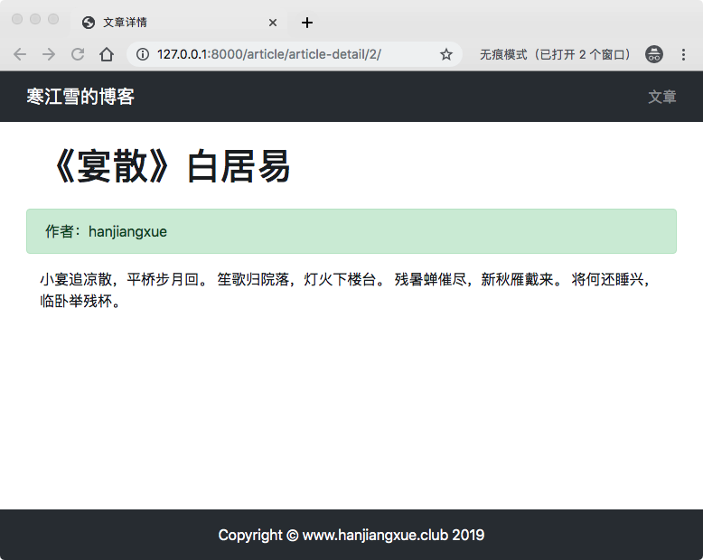
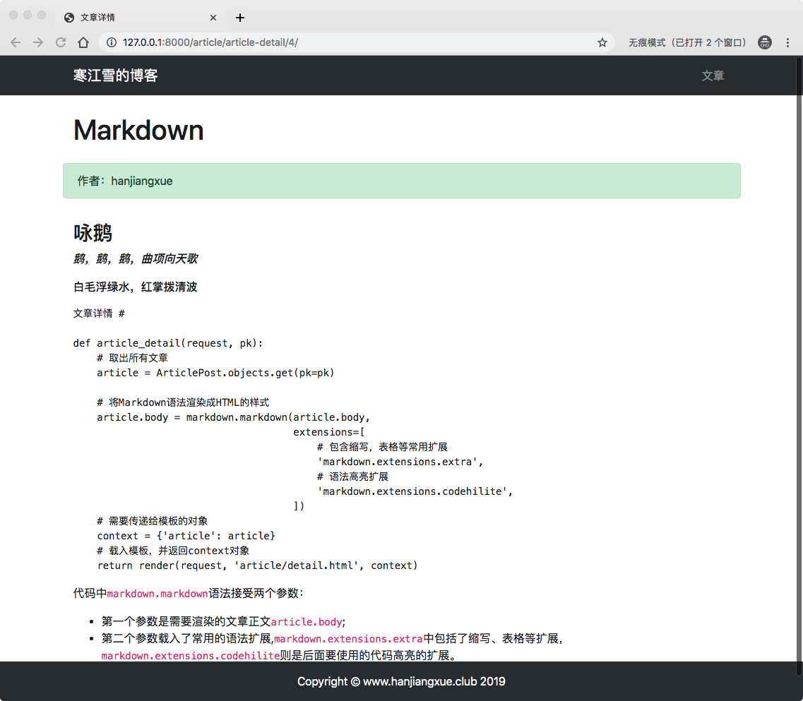
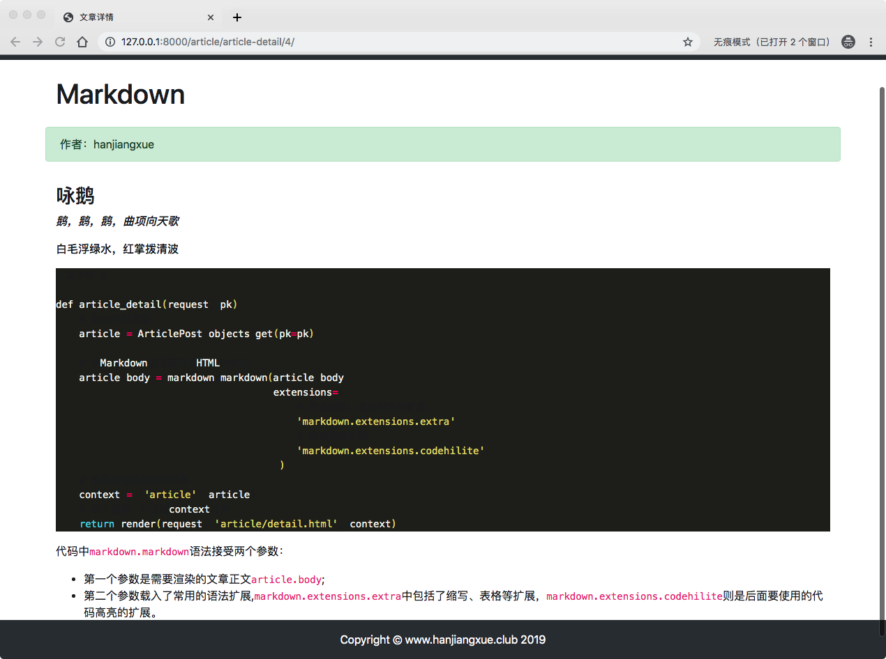

# 5、博客网站搭建五(编写视图详情和Markdown支持)

## 编写视图详情
打开`article/view.py`,增加文章详情页面的视图函数：

```
# 文章详情
def article_detail(request, pk):
    # 取出所有文章
    article = ArticlePost.objects.get(pk=pk)
    # 需要传递给模板的对象
    context = {'article': article}
    # 载入模板，并返回context对象
    return render(request, 'article/detail.html', context)

```
> * `article_detail(request, pk)`函数中增加了一个参数`pk`，我们在写model的时候并没有写叫pk的字段。这是Django自动生成的用于索引数据表的主键（Primary Key， 即pk）。有了它有办法取出具体对应的文章。
> 
> * `ArticlePost.objects.get(pk=pk)`意思是取出id值符合的那个文章。（注意**get**是用来获取一个对象的，如果需要获取满足条件的一些具体情况，就要用到**filter**）

然后编写`article/urls.py`,配置路由：

```
urlpatterns = [

    # path函数将url映射到视图
    path('article-list', views.article_list, name='article_list'),
    # 文章详情
     path('article-detail/<int:pk>/', views.article_detail, name='article_detail'), # 新增
]
```
> `<int:pk>`Django2.0的path信誉发，尖括号`<>`需要定义传递的参数。这里需要传递名叫id的整数到视图函数中去。

## 编写模板
在`templates/article`文件夹中新建`detail.html`,编写如下：

```



{#写入base.html中定义的title#}

    文章详情


{#写入base.html中定义的content#}


{#文章详情    #}
 <div class="container">
        <div class="row">
{#            标题及作者#}
            <h1 class="col-12 mt-4 mb-4">{{ article.title }}</h1>
            <div class="col-12 alert alert-success">作者：{{ article.author }} </div>
{#            文章正文#}
            <div class="col-12">
                <p>{{ article.body }}</p>
            </div>
        </div>
 </div>

```

启动服务，然后再浏览器输入`http://127.0.0.1:8000/article/article-detail/1/`会得到如下：



## 优化网页入口

虽然已经实现了文章详情功能，但是通过输入url访问的方式是不可以取的。

现在我们改写`header.html`，让用户可以通过导航栏右侧的文章链接返回首页：

```
{#定义导航栏#}
...
{#                条目#}
                <li class="nav-item">
                    <a class="nav-link" href="">文章</a> #修改这里
                </li>
...
...
```
> 这里修改了`href`链接跳转地址：
> 
> * ``是Django规定的模板解耦语法，用它可以更具我们在`urls.py`中设置的名字，反向解析到对应的url中去。
> * `article:article_list`解析：
> 	* 前面`article`是在项目根目录的`urls.py`中定义的app的名字。
> 	* 后面`article_list`是在APP中`urls.py`中定义的具体的路由地址。

通过这样的方式就可以将链接跳转指向配置好，只要对应的URL名字不变，url本身无论怎么变化，Django都可以找到正确的地址，很灵活。

然后照着葫芦画瓢，改写`list.html`中，查看全文按钮，进入文章详情页：

```
...
...
         </div>
             <div class="card-footer">
                <a href="" class="btn btn-primary"> 阅读全文</a> # 修改这里
             </div>
      </div>
 ...
 ...
```
>这里比着前面那个多一个参数的传递`article.pk`。这个`article.pk`传递给article/urls.py，通过`<int:id>`传递给视图函数`article_detail()`

然后刷新页面，点击按钮就会跳转到对应的文章详情了，是不是很神奇，是的，就是很神奇。

## Markdown支持
Markdown是一种轻量级的标记语言，它允许人们“使用易读易写的纯文本格式编写文档，然后转换成有效的或者HTML文档。

关于Markdown语法介绍点击这里查看：[Markdown语法介绍](https://www.runoob.com/markdown/md-tutorial.html).

我使用客户端一般使用`macdown`,每个客户端的帮助里面也都会有一套完整的语法说明。

安装Markdown，进入虚拟环境，输入指令`pip install markdown`

## 使用Markdown
>百度团队有一个开源的支持Markdown的项目很好用，可以直接拿来用，这里我们先自己写，后面主题架构完成之后，我们再做方便性优化。

为了将Markdown语法书写文章渲染为HTML文本，我们首先改写articel/views.py的articel_detail方法：

```
#  article/view.py


from django.shortcuts import render
from .models import ArticlePost
import markdown # 新增导入

...
...

# 文章详情
def article_detail(request, pk):
    # 取出所有文章
    article = ArticlePost.objects.get(pk=pk)
    
    # 将Markdown语法渲染成HTML的样式
    article.body = markdown.markdown(article.body,
                                     extensions=[
                                         # 包含缩写，表格等常用扩展
                                         'markdown.extensions.extra',
                                         # 语法高亮扩展
                                         'markdown.extensions.codehilite',
                                     ])
    # 需要传递给模板的对象
    context = {'article': article}
    # 载入模板，并返回context对象
    return render(request, 'article/detail.html', context)
```
> 代码中`markdown.markdown`语法接受两个参数：
> 
> * 第一个参数是需要渲染的文章正文`article.body`;
> * 第二个参数载入了常用的语法扩展,`markdown.extensions.extra`中包括了缩写、表格等扩展，`markdown.extensions.codehilite`则是后面要使用的代码高亮的扩展。

然后修改`templates/article/detail.html`中有关正文的部分：

```
# templates/articel/detail.html


...
...
   <div class="col-12">
   # 在article.bogy后面加上 |safe过滤器
        <p>{{ article.body|safe }}</p>
   </div>
...
...
```
> Django处于安全考虑，会将输出的HTML代码进行转义，这里将`article.body`中渲染的HTML文本无法正常显示。管道符号`|`是Django中过来器的写法，而`|safe`就类似给`article.body`贴了一个标签，表示这一段字符不需要进行转义了呢。
> 如此简单的Markdown语法就给配置好了。

启动服务，在后台写入一下Markdown语法的文章:


```
### 咏鹅

***鹅，鹅，鹅，曲项向天歌***

**白毛浮绿水，红掌拨清波**

``` python
文章详情 #

def article_detail(request, pk):
    # 取出所有文章
    article = ArticlePost.objects.get(pk=pk)
    
    # 将Markdown语法渲染成HTML的样式
    article.body = markdown.markdown(article.body,
                                     extensions=[
                                         # 包含缩写，表格等常用扩展
                                         'markdown.extensions.extra',
                                         # 语法高亮扩展
                                         'markdown.extensions.codehilite',
                                     ])
    # 需要传递给模板的对象
    context = {'article': article}
    # 载入模板，并返回context对象
    return render(request, 'article/detail.html', context)
 ```


> 代码中`markdown.markdown`语法接受两个参数：
> 
> * 第一个参数是需要渲染的文章正文`article.body`;
> * 第二个参数载入了常用的语法扩展,`markdown.extensions.extra`中包括了缩写、表格等扩展，`markdown.extensions.codehilite`则是后面要使用的代码高亮的扩展。
```

启动服务，进入新建文章详情页会看到下面内容：



细心地你会发现，文章首页出现了不支持Markdown的情况。这里我们还是先搁置问题，不影响先把车跑起来，然后我们在考虑是换破音的发动机还是空客的。

## 代码高亮
作为一个程序员，代码你能高亮，就等于你看到有人买了一个最高配的苹果电脑却装的window系统那么难受。

在static目录中新建一个目录`md_css`，一会放代码高亮的样式文件。

进入虚拟环境，安装`Pygments`:`pip install Pygments`

Pygments是一种通用的语法高亮器，可以帮助我们自动生成美化的代码样式。

进入md_css目录中，输入Pygments指定：

	pygmentize -S monokai -f html -a .codehilite > monokai.css

回车检查一下，你会看到md_css文件里面生成了一个monokai.css的文件，这是一个深色背景高亮格式的文件。

接下来我们在`base.html`文件里面引入这个文件：

```
<head>
...
...
{#引入monokai.css文件#}
    <link rel="stylesheet" href="">
</head>
```

重启服务，刷新浏览器，会看到如下内容



>这里展示的是monokia这个深色的样式，除了这个之外，Pygments还内置了很多[其他的颜色](https://github.com/richleland/pygments-css)，根据自己的喜好选择就好了。
>
>至于自定义样式，这些高端用法，还是以后熟悉了，慢慢探索，兴趣是组好的老师，如果页面丑的你自己都看不下去，这时候你肯定会想办法去改观的。