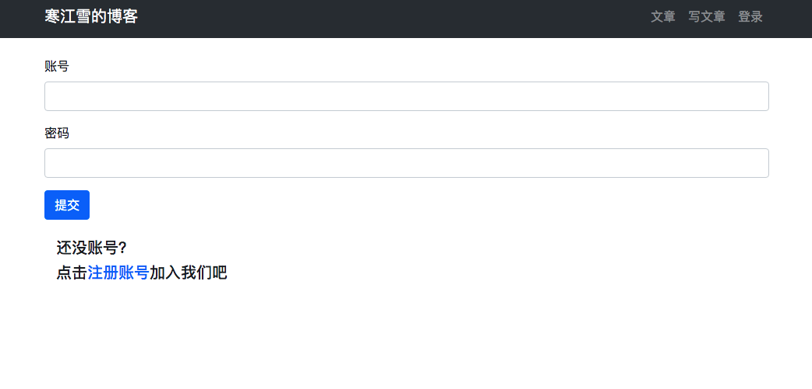

8、博客网站搭建八()

## 8.1 用户注册
注册表单类，用户注册的时候用到表单来提交账号、密码等数据，所以需要些注册用的表单，进入`userprofile/forms.py`文件添加如下：

```
...
...
# 注册表单用户
class UserRegisterForm(forms.ModelForm):
    
    # 赋值User密码
    password = forms.CharField()
    password2 = forms.CharField()
    
    class Meta:
        model = User
        fields = ('username', 'email')
        
    # 对两次的输入密码是否一致进行检查 
    def clean_password2(self):
        data = self.cleaned_data
        if data.get('password') == data.get('password2'):
            return data.get('password')
        else:
            raise forms.ValidationError('密码输入不一致，请重试')      
```
> 前面说过，对数据库进行操作的表单应该继承forms.ModelForm,可以自动生成模型中已有的子弹。
>
>这里我们覆写`password`字段，因为通常注册时候需要重复输入`password`来确保用户没有将密码输入错误，覆写掉它一遍我们自己进行数据验证工作。` def clean_password2()`中的内容便是在验证密码是否一致。`def clean_[字段]`这种写法**Django会自动调用，来对单个字段的数据验证清洗。**
>
>覆写某个字段之后，内部类`class Meta`中定义的这个字段就没有效果了，所以`fields`不用包含`password`.
>
>**注意：**
>
>* 验证密码一致性不能写`def clean_password()`,因为如果你不定义`def clean_password2()`方法，会导致password2中的数据被Django判定为无效数据从而清洗掉，从而`password2`属性不存在。最终导致两次密码输入始终会不一致，而且很难判断出错误原因。
>* 从POST中取值用`data.get('password')`是一种稳妥的写法，及时用户没输入密码也不会导致程序出错而跳出。前面我们取数据用了`data['passworf']`,这种取值方式data中不包含`password`，Django会报错，另一种防止用户不输入密码的提交方式就是表单中插入`require`属性，后面会讲到。

## 视图函数
编写注册的视图：进入`userprofile/views.py`：

```
from .forms import UserLoginForm, UserRegisterForm # 引入注册类

...
...
...
# 用户注册

def user_register(request):
    if request.method == 'POST':
        user_register_form = UserRegisterForm(data=request.POST)
        if user_register_form.is_valid():
            new_user = user_register_form.save(commit=False)
            # 设置密码
            new_user.set_password(user_register_form.cleaned_data['password'])
            new_user.save()
            # 保存好数据后立即登录并返回博客页面
            login(request, new_user)
            return redirect('article:article_list')
        else:
            return HttpResponse('注册表单输入有误。请重新输入~')
    elif request.method == 'GET':
        user_register_form = UserRegisterForm()
        context = {'form': user_register_form}
        return render(request, 'userprofile/register.html', context)
    else:
        return HttpResponse('请使用GET或者POST请求数据')
    

```
> 这里对比文章发布和用户登录视图，基本一样。

## 模板和URL
这里和以前基本也一样,新建`templates/userprofiles/register.html`:

```




    注册




<div class="container">
    <div class="row">
        <div class="col-12">
            <br>
            <form method="post" action=".">
                
                
{#                账号#}
                <div class="form-group col-md-4">
                    <label for="username">昵称</label>
                    <input type="text" class="form-control" id="username" name="username" required>
                </div>
                
{#                邮箱#}
                <div class="form-group col-md-4">
                    <label for="email">Email</label>
                    <input type="text" class="form-control" id="email" name="email">
                </div>
                
{#                密码#}
                <div class="form-group col-md-4">
                    <label for="password">设置密码</label>
                    <input type="text" class="form-control" id="password" name="password" required>
                </div>
{#                确认密码#}
                <div class="form-control col-md-4">
                    <label for="password2">确认密码</label>
                    <input type="text" class="form-control" id="password2" name="password" required>
                </div>
                <button type="submit" class="btn btn-primary">提交</button>
            </form>
        </div>
    </div>
</div>

```
> 上面的模板中，我们在昵称，密码标签中添加了`required`的属性，如果用户不填写带有`required`属性的字段，表单就不能提交，并且提示用户填写。

注册的入口可以放在任何地方，这里先放在了登录页面中，丑就丑点吧，后面在优化，先做功能：进入`templates/userprofile/login.html`：

```
...
...
<div class="container">
    <div class="col-12">
        <br>
        <h5>还没账号？</h5>
        <h5>点击<a href="">注册账号</a>加入我们吧</h5>
        <br>
    </div>
</div>
...
```
最后就是在APP中配置路由文件,进入`userprofile/urls.py`:

```
urlpatterns = [
...
...
    # 用户注册
    path('register/', views.user_register, name='register'),
]
```

搞定收工，下面启动服务，进入登录页面：


点击注册账号：


